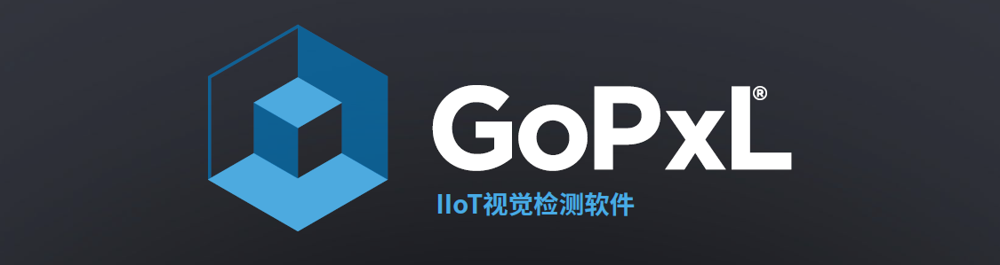
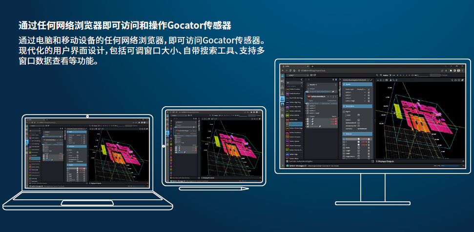
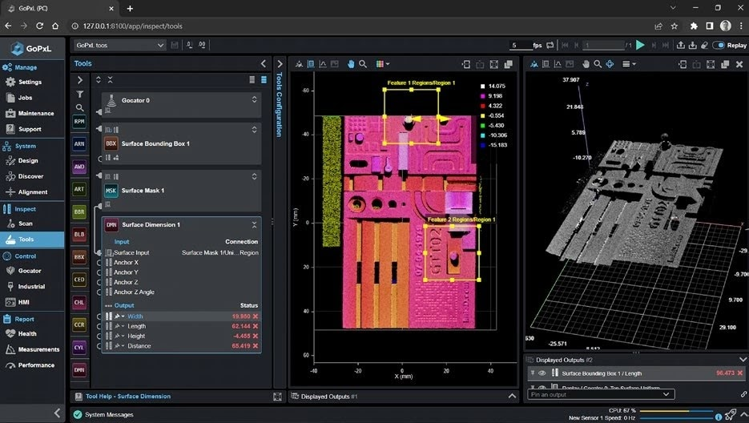
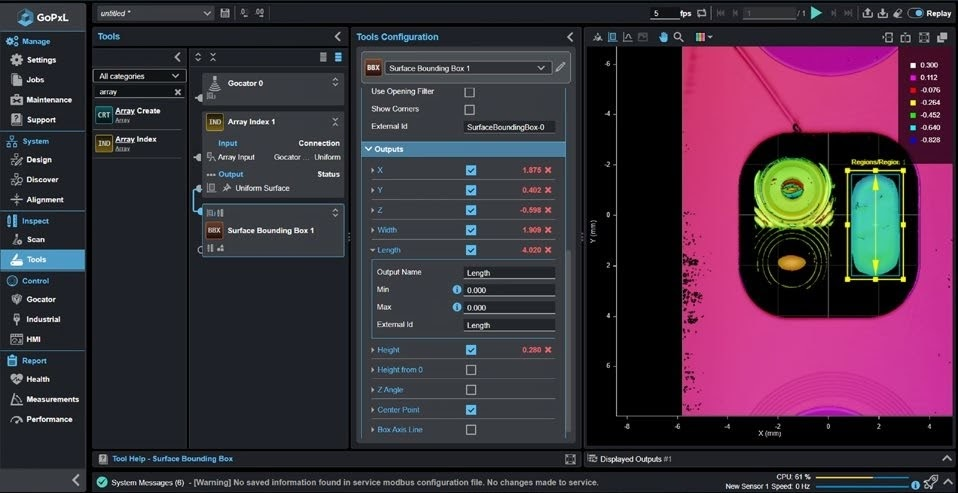
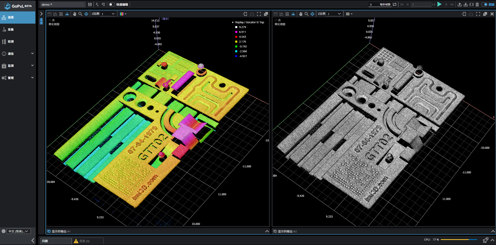
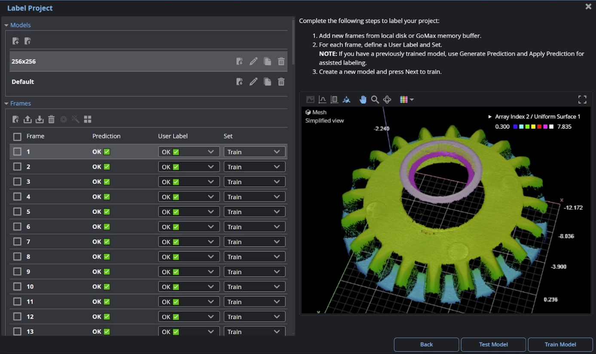
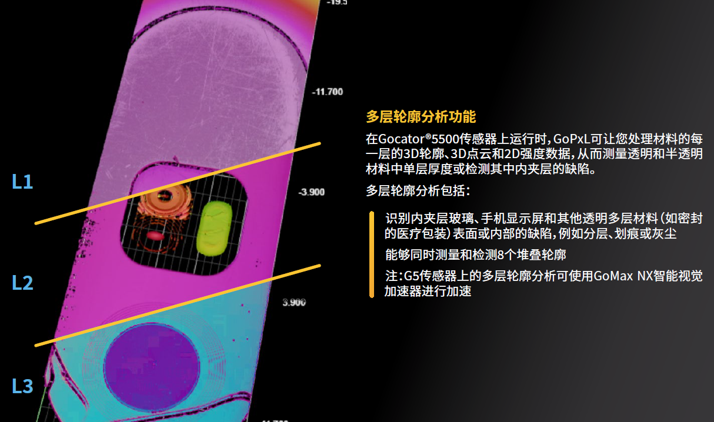
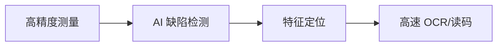

# GoPxL® 软件特点介绍

{: style="width:100%; border-radius: 10px; box-shadow: 0 4px 20px rgba(0,0,0,0.3); margin-bottom: 20px;" }

GoPxL® 是 LMI Technologies 推出的一款 IIoT 视觉检测软件平台，专门用于在 Gocator® 3D 智能传感器和 2D 智能相机上创建和部署端到端的、基于网络的在线测量和检测解决方案。

---

## 1. 核心软件特点

### 🌐 现代化的基于 Web 的用户界面

=== "🌐 跨平台访问"
    

        
    

=== "🎨 直观设计"
    

        
    

=== "🔍 便捷管理"
    

        
    

### 📐 多维度 (2D/3D) 测量与 AI 检测

=== "📊 全数据处理"

    直接处理 3D 轮廓 (Profile)、点云 (Surface)、Mesh 数据及 2D 强度图，提供全方位的视觉分析。

    

        <a href="images/gopxl_introduction/data_processing_demo.gif" class="glightbox video-trigger">
            {: style="border-radius:10px;" }
        </a>
    

=== "🧠 集成 AI 工具"

    内置异常检测 (Anomaly Detector)、分类、OCR及条码读取，支持设备端推理应对复杂检测。

    

        <a href="images/gopxl_introduction/ai_tools_demo.gif" class="glightbox video-trigger">
            {: style="border-radius:10px;" }
        </a>
    

=== "🔍 多层材料扫描"

    配合 Gocator 5500 系列，支持多达 8 个堆叠轮廓的测量，适用于夹层玻璃、显示屏等厚度检测。

    

        <a href="images/gopxl_introduction/multi_layer_demo.gif" class="glightbox video-trigger">
            {: style="border-radius:10px;" }
        </a>
    

### 🚀 分布式数据处理与硬件加速
!!! tip "性能优化"
    GoPxL 支持将数据流加载至 **Windows PC** 或 **GoMax® NX** 智能视觉加速器，利用计算机或 GPU 算力显著提升数据密集型应用的处理帧率。

### 🏭 丰富的工业通讯协议
GoPxL 内置了主流工业协议，确保与 PLC 和机器人系统的无缝对接：

* **标准协议**：EtherNet/IP, Modbus TCP, PROFINET, Ethernet ASCII。
* **开发接口**：提供 GDP 协议、GoPxL SDK 和 REST API，便于开发自定义客户端。

    <a href="images/gopxl_introduction/protocol_architecture.png" class="glightbox" style="display: flex; align-items: center; text-decoration: none; color: #2196f3; font-weight: bold;">
        📋 
        点击查看工业协议架构图
    </a>

## 2. 进阶功能展示

-   [:material-layers-triple:{ .lg .middle } __数组与批量处理__](../images/gopxl_introduction/Array_show.gif){: .glightbox }
    ---
    通过 `Array Create` 实现特征捆绑。开启 **Batching** 模式可用单一工具独立测量所有重复特征（如引脚）。

-   [:material-vector-combine:{ .lg .middle } __多传感器校准__](../images/gopxl_introduction/multi_sensor_calibration.png){: .glightbox }
    ---
    提供图形化向导，支持将并排、多角度或 360° 布局的多台传感器数据拼接为单一宽轮廓或 Mesh。

-   [:material-monitor-dashboard:{ .lg .middle } __定制化 HMI__](../images/gopxl_introduction/hmi_designer_demo.mp4){: .glightbox }
    ---
    内置 **GoHMI Designer**，包含 40 多个拖放式组件，轻松搭建专属的 OK/NG 状态及测量值显示界面。

-   [:material-play-circle-outline:{ .lg .middle } __仿真与回放__](../images/gopxl_introduction/emulator_replay_demo.gif){: .glightbox }
    ---
    提供 **Emulator** 进行离线模拟，以及 **Replay Editor** 支持 `.gprec`, `.sur` 等格式的数据导入导出。

## 3. 行业应用与市场

### 🏭 核心目标行业

| 行业 | 典型应用场景 |
| :--- | :--- |
| **汽车与新能源** | 引擎缸体检测、焊缝引导、动力电池在线检测、孔位标定。 |
| **3C 电子/半导体** | PCB 板检测、连接器引脚测量、手机显示屏多层材料缺陷检测。 |
| **医疗与食品包装** | 医疗包装完整性检测、包装盒空隙测量、食品质量与色彩验证。 |
| **通用制造** | 木板质量检测、线缆表面污损检测、紧固件三维尺寸测量。 |

### 🎯 核心检测任务流

一个典型的检测任务如下

## 👥 适用用户群体

GoPxL 凭借其高扩展性和直观的用户体验，主要面向以下三类核心群体：

!!! example "终端用户与制造商"
    适用于需要可靠、灵活且易于维护的视觉系统，并希望系统能够随着生产需求变化而灵活扩展的企业。

!!! example "系统集成商 (Integrators)"
    适用于追求快速部署、跨工位便捷扩展的团队。利用内置硬件加速特性，部分场景下甚至无需额外配置工控机（PC）即可完成部署。

!!! example "Gocator® 传感器现有用户"
    适用于需要在同一 3D 生态系统内增加 2D 检测功能，或希望升级原有 Gocator 固件以获取更强大 AI 及数组工具的用户。

## 🎯 GoPxL Pro Tool 功能介绍

从原型开发到量产，GoPxL 在生产现场可即时优化并执行以下核心任务：

### 1. 高精度尺寸与形位测量
以物理单位精确测量 **间隙、面差（偏移量）、直径、角度、高度及体积**，确保产品符合严苛的公差要求。

### 2. AI 缺陷检测与分类
结合 **异常检测 (Anomaly Detector)** 和分类工具，实时识别复杂表面或反光材料上的划痕、污染、凹陷、错印及特征缺失，有效降低过杀和漏杀率。

### 3. 特征定位与动态追踪
即使在密集的电路板或复杂的组件上，也能高精度定位引脚、端口或零件特征，并支持 **机器人视觉引导**。

### 4. 高速 OCR 与读码追溯
针对高速运动目标，提供高达 **84 FPS** 的成像能力，在不降低生产速度的前提下，实时读取序列号、DMC 码及条码标签。

### 🧊 实时 3D 点云交互演示
---
!!! info "操作提示"
    按住鼠标左键旋转查看，滚轮缩放，右键平移。

<<<<<<< HEAD
<iframe src="../cloud_viewer.html" width="100%" height="500px" style="border: none; border-radius: 10px; background: #000;"></iframe>

!!! info "下一步建议"
    如果您已经了解了 GoPxL 的基本概况，建议前往 [**快速上手**](gopxl_quickstart.md) 章节开始您的第一个视觉任务配置。

=======
## 2. 进阶功能展示

-   :material-layers-triple:{ .lg .middle } __数组与批量处理__
    ---
    通过 `Array Create` 实现特征捆绑。开启 **Batching** 模式可用单一工具独立测量所有重复特征（如引脚）。

-   :material-vector-combine:{ .lg .middle } __多传感器校准__
    ---
    提供图形化向导，支持将并排、多角度或 360° 布局的多台传感器数据拼接为单一宽轮廓或 Mesh。

-   :material-monitor-dashboard:{ .lg .middle } __定制化 HMI__
    ---
    内置 **GoHMI Designer**，包含 40 多个拖放式组件，轻松搭建专属的 OK/NG 状态及测量值显示界面。

-   :material-play-circle-outline:{ .lg .middle } __仿真与回放__
    ---
    提供 **Emulator** 进行离线模拟，以及 **Replay Editor** 支持 `.gprec`, `.sur` 等格式的数据导入导出。

## 3. 行业应用与市场

### 🏭 核心目标行业

| 行业 | 典型应用场景 |
| :--- | :--- |
| **汽车与新能源** | 引擎缸体检测、焊缝引导、动力电池在线检测、孔位标定。 |
| **3C 电子/半导体** | PCB 板检测、连接器引脚测量、手机显示屏多层材料缺陷检测。 |
| **医疗与食品包装** | 医疗包装完整性检测、包装盒空隙测量、食品质量与色彩验证。 |
| **通用制造** | 木板质量检测、线缆表面污损检测、紧固件三维尺寸测量。 |

### 🎯 核心检测任务流

---

## 👥 适用用户群体

GoPxL 凭借其高扩展性和直观的用户体验，主要面向以下三类核心群体：

!!! example "终端用户与制造商"
    适用于需要可靠、灵活且易于维护的视觉系统，并希望系统能够随着生产需求变化而灵活扩展的企业。

!!! example "系统集成商 (Integrators)"
    适用于追求快速部署、跨工位便捷扩展的团队。利用内置硬件加速特性，部分场景下甚至无需额外配置工控机（PC）即可完成部署。

!!! example "Gocator® 传感器现有用户"
    适用于需要在同一 3D 生态系统内增加 2D 检测功能，或希望升级原有 Gocator 固件以获取更强大 AI 及数组工具的用户。

## 🏭 核心目标行业

GoPxL 的高精度、高速处理以及强大的多维（2D/3D）工具库，使其能够广泛应对以下行业的工业检测难题：

| 行业分类 | 核心应用点 |
| :--- | :--- |
| **汽车制造与新能源** | 引擎缸体/气缸盖检测、焊缝引导、胶路检测、动力电池在线检测。 |
| **3C 电子与半导体** | PCB 板检测、连接器引脚 (Pins) 计数与测量、手机多层材料厚度及缺陷检测。 |
| **医疗与食品包装** | 医疗包装完整性检测、包装盒空隙测量、食品（如巧克力、软糖）质量与色彩验证。 |
| **通用制造** | 木板质量检测、紧固件三维尺寸测量、线缆/编织线表面污损检测。 |

## 🎯 典型检测应用场景

从原型开发到量产，GoPxL 在生产现场可即时优化并执行以下核心任务：

### 1. 高精度尺寸与形位测量
以物理单位精确测量 **间隙、面差（偏移量）、直径、角度、高度及体积**，确保产品符合严苛的公差要求。

### 2. AI 缺陷检测与分类
结合 **异常检测 (Anomaly Detector)** 和分类工具，实时识别复杂表面或反光材料上的划痕、污染、凹陷、错印及特征缺失，有效降低过杀和漏杀率。

### 3. 特征定位与动态追踪
即使在密集的电路板或复杂的组件上，也能高精度定位引脚、端口或零件特征，并支持 **机器人视觉引导**。

### 4. 高速 OCR 与读码追溯
针对高速运动目标，提供高达 **84 FPS** 的成像能力，在不降低生产速度的前提下，实时读取序列号、DMC 码及条码标签。

!!! info "下一步建议"
    如果您已经了解了 GoPxL 的基本概况，建议前往 [**快速上手**](gopxl_quickstart.md) 章节开始您的第一个视觉任务配置。

>>>>>>> d1d09f9 (feat: 优化 GoPxL 软件介绍页面，增加动态 GIF 演示和 CSS 悬停效果)
