# **GoPxL® 软件特点介绍**

{: style="width:100%; border-radius: 10px; box-shadow: 0 4px 20px rgba(0,0,0,0.3); margin-bottom: 20px;" }

??? quote "📝 手册更新日志 (Changelog)"
    
    | 说明书版本 | 更新日期 | 更新者 | 更新说明 |
    | :--- | :--- | :--- | :--- |
    | **V1.0** | <code style="white-space: nowrap;">2026-04-01</code> | **Alfred&nbsp;Pu** | 初始版本，根据国外资料完成出版说明 |

GoPxL® 是 LMI Technologies 推出的一款新一代 IIoT 视觉检测软件平台，用于创建端到端、基于 Web 的在线测量与检测解决方案，可部署在 Gocator® 3D 智能传感器和 Gocator®2D 智能相机上，并支持在 GoMax®或 PC 上运行。

视觉工程师可使用 GoPxL® 完成广泛的工业检测任务，通过结合运行在 Gocator 业界领先视觉硬件上的设备端测量滤波器和检测工具，实现高效、可靠的在线检测解决方案。

---

## **1.核心软件特点**

-   [:material-web: 现代化的 Web 用户界面](#section1)
-   [:material-target: 单传感器或多传感器校准](#section2)
-   [:material-axis-arrow: 多维度 (2D/3D) 测量功能](#section3)
-   [:material-rocket-launch: 多传感器数据处理和加速](#section4)
-   [:material-monitor-dashboard: 定制化人机界面设计](#section5)
-   [:material-lan: 全面的工业通讯协议](#section6)

### **🌐 现代化的基于网络浏览器的用户界面**

GoPxL® 采用了完全基于 Web 浏览器的用户界面，无需安装任何客户端软件，即可实现跨设备（PC、平板、手机）的访问与操作。

=== "🌐 跨平台访问"
    
随时随地，跨设备访问

    
    通过电脑和移动设备的任何网络浏览器，即可访问 Gocator 传感器。现代化的用户界面设计，包括可调窗口大小、自带搜索工具、支持多窗口数据查看等功能。
    
    

        

            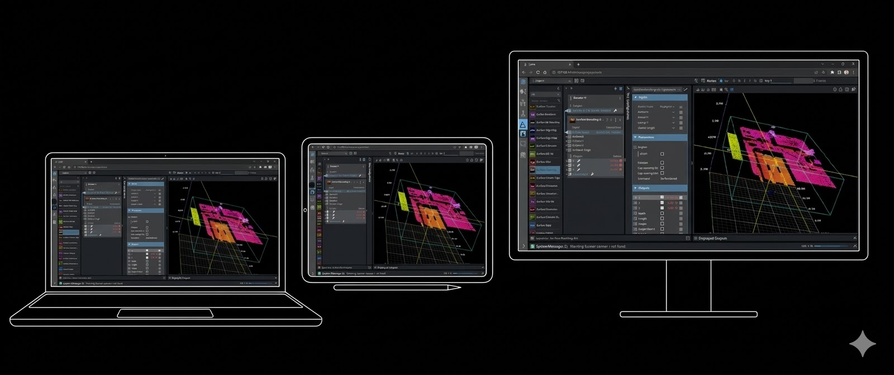
        

        
<i>支持通过 PC、平板和手机浏览器直接访问</i>

    

=== "📦 开箱即用"
    
传感器和系统设置简单，开箱即用

    
    GoPxL 使连接和运行传感器或传感器网络、获取扫描图以及向工厂网络传达测量结果更简单。
    
    * **极简流程**：将传感器连接 to GoPxL -> 创建作业 -> 校准 -> 获取扫描 -> 内置工具测量 -> 输出结果。
    * **开箱即用**：无需额外软件，完全的嵌入式架构直接网页访问传感器进行配置 。
    
    

        

            
        

    

=== "🖥️ 操作简单"
    
高端现代化的界面，操作简单易懂

    
    * **零代码设置**：GoPxL 提供了从扫描、检测、界面显示到数据输出的全流程无代码解决方案。
    * **极简的拖拽式工具管理**：配置测量逻辑时，用户可通过直观的“拖放”操作轻松插入或重新排序各类工具。
    * **业界领先的3D显示**：通过现代化的人机界面和业界领先的3D显示组件，给客户最直观的3D效果显示。
    
    

        

            
        

    

=== "🔍 数据可视化"
    
全面控制实现数据可视化

    
    不仅在传感器中，在离线模拟器里也可实现数据的高效管理。
    
    * **宽屏优化**：精简图形布局，最大化数据可视度。
    * **多窗查看**：通过最多四个分割窗口同时查看不同工具和滤波的点云及输出结果。
    * **实时反馈**：连续循环功能可立即看到每一帧的最新测量结果，无需反复点击“开始”。
    
    

        

            
        

    

=== "⚙️ 专业的图像处理工具"
    
使用精简的工具和滤波管理

    
    GoPxL®提供了精简的工具和滤波操作，最大限度地方便使用和提高生产效率。。
    
    * **拖拽式灵活配置**：支持通过拖放轻松在任何位置插入工具或调整工具顺序。
    * **多维度快速检索**：借助搜索栏、分类和图标，迅速查找到所需的测量工具。
    * **内嵌式实时帮助**：无需退出应用界面，即可直接查阅工具的功能与使用指南。
    
    

        

            
        

    

### **🎯 轻松进行单传感器或多传感器校准**

GoPxL 提供直观的校准向导，确保传感器可轻松校准并执行准确且稳定的测量。结合业内领先的智能多传感器网络结构，能够灵活高效地满足各种复杂的扫描与检测需求。

=== "🖱️ 直观的校准向导"
    
点击即可运行，轻松上手

    
    * **操作简便**：校准向导通过点击操作，直观地向您展示了如何校准单台传感器或多传感器系统。
    * **图标引导**：通过增加图标引导轻松进行校准，提供快速的单、多传感器校准，最大限度地方便使用和控制。
    * **深度反馈**：系统提供更多反馈信息，使用户可更深入地了解测量结果。

    

        

            
        

        
<i>点击即可运行的传感器校准向导界面</i>

    

=== "🌐 强大的多传感器组网"
    
业内领先的智能网络结构

    
    * **灵活组合**：LMI可以灵活组合任意数量的传感器进行多传感器六自由度标定。
    * **多种布局支持**：支持不同布局，例如并排、多角度、反向和环形布局。
    * **广泛覆盖**：是需要覆盖更大扫描范围以及 360º 扫描大型、复杂和圆柱形目标物的理想选择。

    

        

            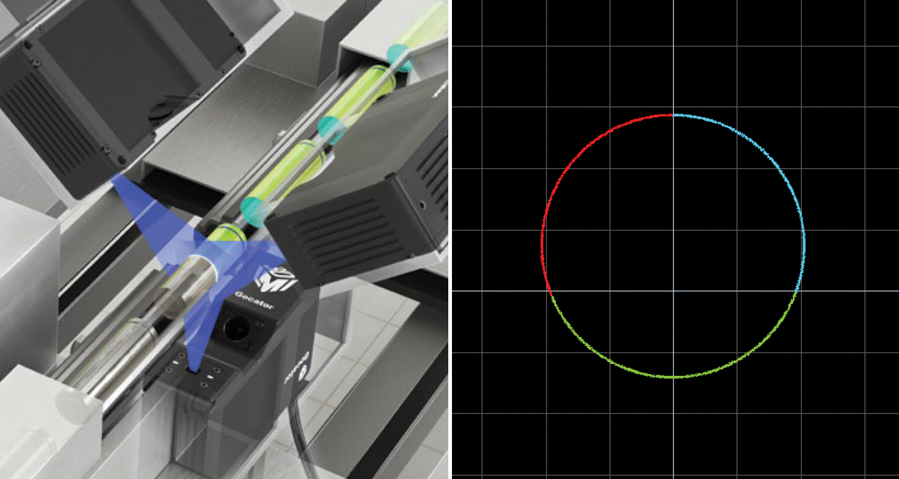
        

        
<i>支持并排、多角度、反向和环形等多种布局</i>

    

=== "⚡ 高性能与精准同步"
    
高分辨率与微秒级控制

    
    * **画质无损**：在实现更大视野的同时保持高分辨率。
    * **极强的扩展与同步**：Master 节点最多可连接 24 个传感器，并控制微秒级数据同步、电源和激光安全。

    

        

            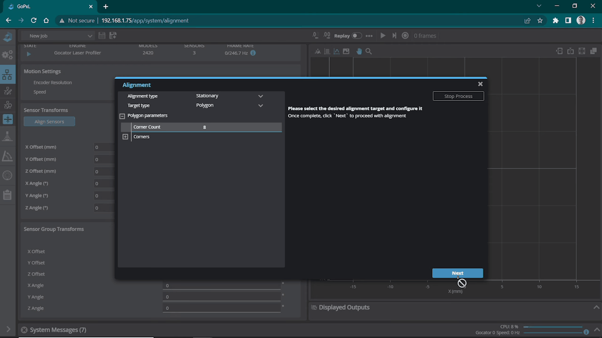
        

        
<i>最多支持 24 个传感器的高性能同步控制</i>

    

### **📐 多维度（2D/3D）测量与高级分析**

GoPxL® 能够全面获取并处理 3D 形状和 2D 强度数据。凭借其内置的丰富测量工具、阵列处理能力以及自定义脚本支持，无需购买第三方软件即可轻松应对各类复杂的工业检测挑战。

=== "🧰 丰富的内置工具与滤波"
    
充分利用传感器上的测量工具和滤波功能

    
    * **全面且强大的工具库**：内置丰富的测量工具以及滤波器，包括零件检测、零件匹配、零件剖面、零件分割、点云跟踪等。
    * **无需第三方软件**：自带完整的算法链，用户不需要购买第三方软件或消耗其他资源来开发基础算法。
    * **持续进化与定制**：软件会定期更新并不断扩展工具集，同时高级用户也能使用 SDK 和 GDK 软件包开发自己的专属测量算法。

    

        

            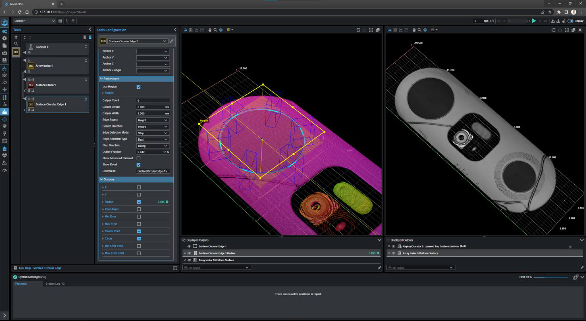
        

        
<i>内置丰富的 3D 点云与 2D 图像处理工具</i>

    

=== "👁️ 2D与3D同步检测"
    
将测量结果同步应用于 2D (强度) 和 3D (形状) 数据

    
    * **一机双数据**：Gocator 可以实现从一个设备同时生成 2D 图像数据、3D 点云/轮廓数据以及相应的测量结果。
    * **2D 表面检测**：执行简单高效的基于对比度的 2D 检测，如表面标记、条形码识别和印刷文本检测 (OCR)。
    * **3D 高级分析**：同时对各种制造零件、装配组件及有机材料进行基于 3D 形状（例如高度、宽度、体积）的高级高精度检测。

    

        

            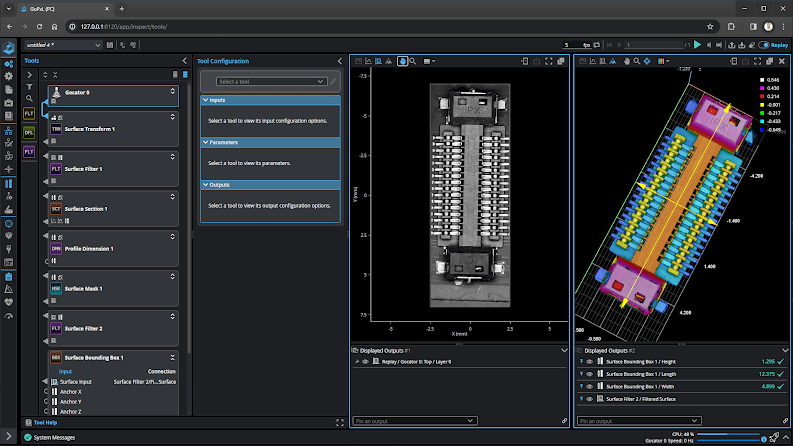
        

        
<i>同时获取目标的 2D 表面信息与 3D 几何尺寸</i>

    

=== "🥞 多层轮廓分析"
    
针对透明/半透明材料的断层扫描

    
    * **穿透性测量**：在 Gocator® 5500 线共焦传感器上运行时，GoPxL 支持处理材料每一层的 3D 轮廓和 2D 强度数据。
    * **多达 8 层同步解析**：能够同时测量和检测多达 8 个堆叠轮廓，并可通过 GoMax NX 加速器进一步提升处理速度。
    * **检测内部缺陷**：完美适用于测量内夹层玻璃、手机显示屏或密封医疗包装等材料的单层厚度，并能精准识别其内部或表面的分层、划痕与灰尘缺陷。

    

        

            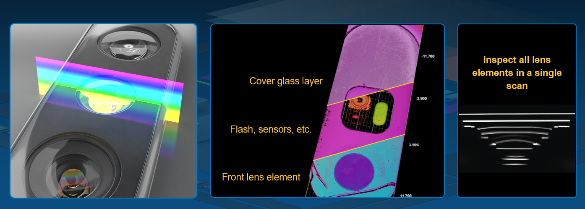
        

        
<i>Gocator 5500 搭配 GoPxL 实现多层结构内部缺陷检测</i>

    

=== "📦 阵列流与批量操作"
    
阵列结构数据与自动化工具批量处理

    
    * **阵列结构数据流 (Array)**：支持将一组数据（如一个轮廓阵列或点云阵列）捆绑成单个数据对象。
    * **应对不规则重复特征**：当工件包含许多类似但位置未知的特征（如成千上万个齿轮齿）时，工具批量处理功能尤为强大。
    * **一键批量测量**：工具输出值作为阵列后，可直接对阵列中的每个元素执行批量测量。例如，配合体积工具获取每个表面的体积。

    

        

            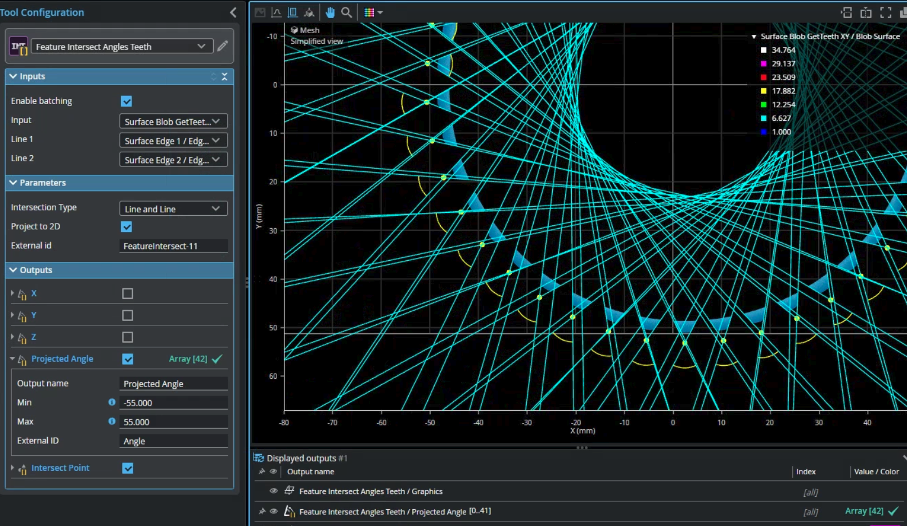
        

        
<i>一次配置即可自动对阵列中的成百上千个特征进行测量</i>

    

=== "🐍 Python 脚本自定义"
    
内置灵活的 Python 脚本工具编写专属逻辑

    
    * **免去外部 PLC/PC 逻辑**：用户可以在传感器内部直接添加控制逻辑，使用 Python 自定义处理测量值、点云或几何特征。
    * **智能查错与存储**：单作业内可添加多个脚本。内置的错误日志弹出窗口会精确提示需要更正的代码行，并支持访问时间戳信息。

    

        

            
        

        
<i>支持在工具链中直接嵌入 Python 脚本处理复杂测量逻辑</i>

    

### **🚀 分布式多传感器数据处理和加速**

针对需要庞大数据量的高速或高要求检测场景，GoPxL 提供了灵活的分布式数据处理架构。您可以使用 GoMax 嵌入式设备或标准电脑，轻松为单传感器和多传感器系统进行提速。

=== "⚡ 系统扩展与加速概述"
    
突破算力瓶颈，提升整体检测性能

    
    * **灵活的算力卸载**：通过将计算任务转移，可以有效为单个传感器应用加速，提升系统的最大运行帧率。
    * **轻松扩大系统规模**：当应用在多个 Gocator 传感器上时，分布式处理能够汇聚并应对庞大的点云数据，从而提高整体的检测性能。
    * **多种加速媒介**：系统支持通过专用嵌入式硬件（GoMax）或标准台式/工业电脑（PC）进行算力拓展。

    

        

            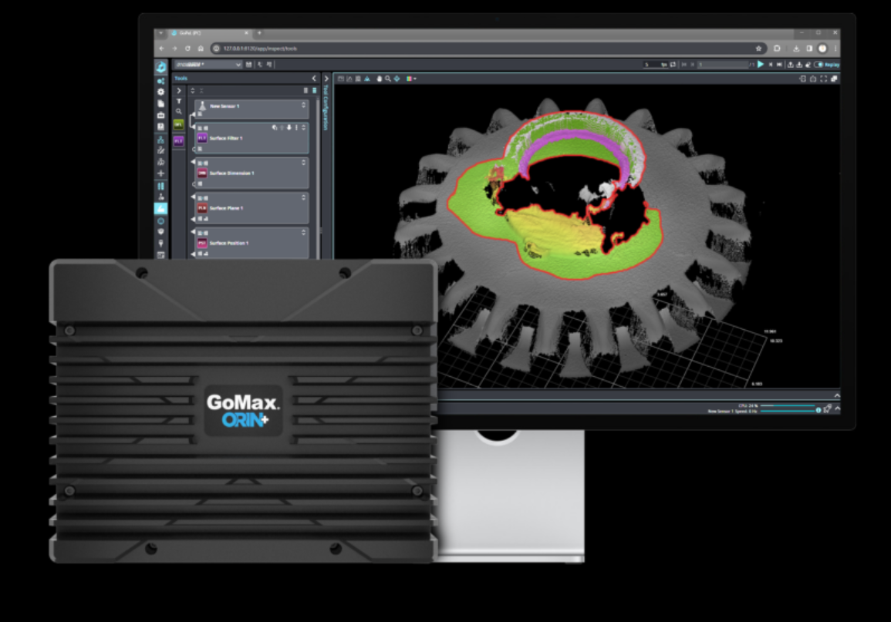
        

        
<i>支持使用 GoMax 或 PC 为传感器网络加速</i>

    

=== "🎛️ GoMax® 智能视觉加速器"
    
专为工业现场打造的嵌入式 GPU 算力

    
    GoMax® 是一台高性能的嵌入式设备，可对任何 Gocator® 传感器或多传感器网络进行加速，是大型检测应用的理想选择。

    * **紧凑的工业级设计**：采用无风扇冷却系统，设计紧凑且易于使用，为您省去了配置工业 PC 或控制器的繁琐步骤。
    * **GPU 级实时处理**：直接在设备上运行 GoPxL® 检测软件，利用强大的 GPU 处理能力最大限度地缩短检测周期，优化整体性能。
    * **应对高要求应用**：在引擎缸体、焊缝、胶路和医疗包装检测等复杂应用中能够达到最佳的检测效果。
    * **极致的网络扩展**：不仅能同时加速多台 Gocator 组成的传感器网络，还可以通过叠加多台 GoMax® 硬件来实现算力的进一步提速。

    

        

            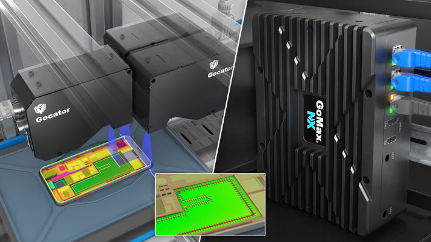
        

        
<i>紧凑无风扇的 GoMax® 智能视觉加速器</i>

    

=== "💻 基于 PC 的应用加速"
    
利用电脑算力释放数据处理潜能

    
    除了使用嵌入式设备，用户还可以选择在电脑（PC）上运行 GoPxL 实例，并直接连接至传感器实现加速。

    * **性能大幅飞跃**：将传感器获取的实时数据上传到 PC，可以充分利用电脑更充裕的内存和强大的 CPU/GPU 算力，大幅加速点云生成和测量工具的处理速度。
    * **无缝的控制体验**：得益于统一的架构，通过基于网络浏览器的 GoPxL 用户界面即可在电脑端轻松访问和控制，操作体验与直连传感器完全一致。
    * **保留标准工业通讯**：即使数据处理转移到了 PC 端，系统依然保持 Gocator 原生的通信协议（如 EtherNet/IP、Modbus、ASCII），确保检测结果能无缝、顺畅地发送到工厂控制网络。

    

        

            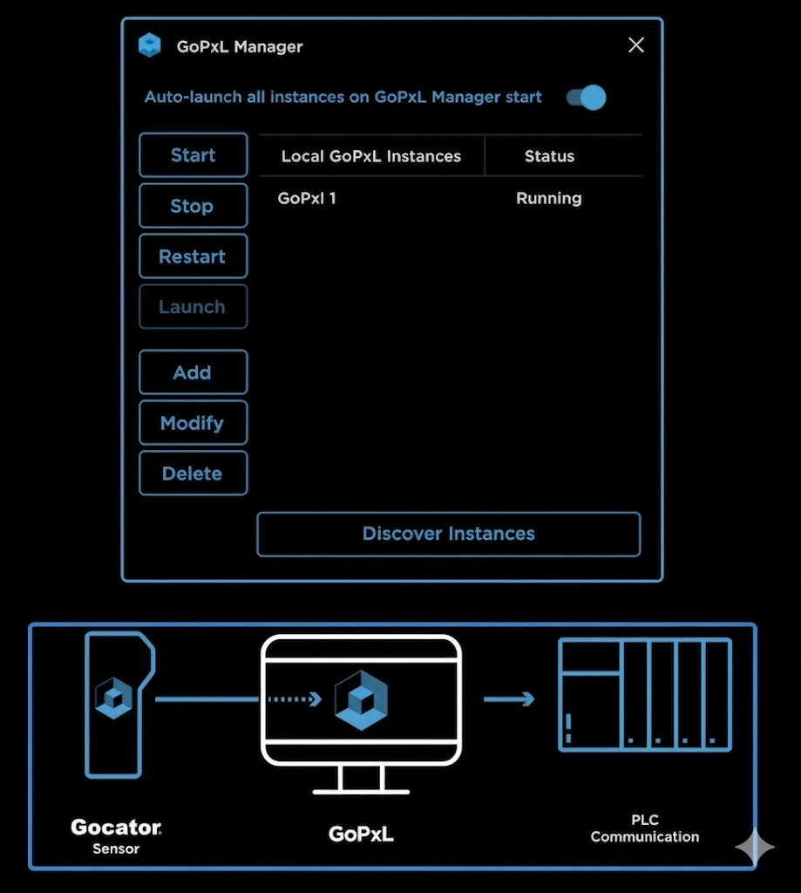
        

        
<i>在 PC 端运行 GoPxL 实例进行系统加速与数据通讯</i>

    

### **🖥️ 定制化人机界面设计 (GoHMI)**

GoHMI Designer 是 GoPxL 内置的全新应用程序，专门用于为终端用户建立定制化的数据可视化界面，帮助工厂轻松实现实时数据监控与交互控制。

=== "🛠️ 零代码拖拽式设计"
    
所见即所得，快速构建专属界面

    
    * **免编程零门槛**：通过拖放式添加控件，无需进行任何代码编程即可搭建界面。
    * **内含 40 多个小组件**：系统内置了丰富且具有专业外观的模板化元素，只需选择合适的图表、仪表盘或按钮小组件，拖放添加即可。
    * **极速上手体验**：借助其直观的操作逻辑，用户在短短几天内即可熟练掌握，迅速、轻松地创建基于网络的高级用户界面。

    

        

            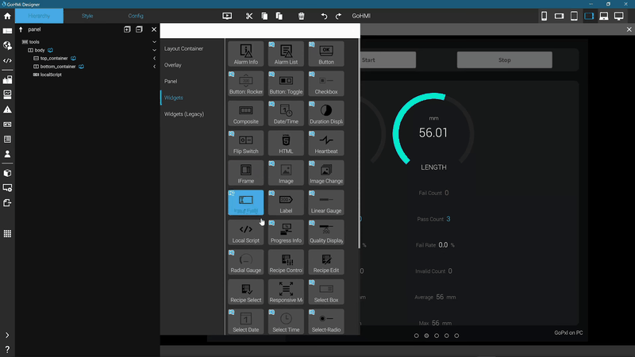
        

        
<i>提供 40 多种专业组件的拖拽式开发界面</i>

    

=== "🚀 灵活部署与跨设备访问"
    
随时随地掌控生产现场状态

    
    * **边缘与本地部署**：定制化 HMI 部署方式极其灵活，既可以直接部署在 Gocator 智能传感器内部，也可以运行在 GoMax NX 加速器或标准 PC 上。
    * **多终端完美适配**：其灵活的响应式设计适用于各种类型的设备，无论是移动端的手机、平板电脑，还是大型的工业 PC 显示器，都能完美呈现视觉效果。
    * **即刻网络访问**：可轻松在生产车间进行部署，并通过已连接到传感器网络中的任意设备的网络浏览器进行立即访问。

    

        

            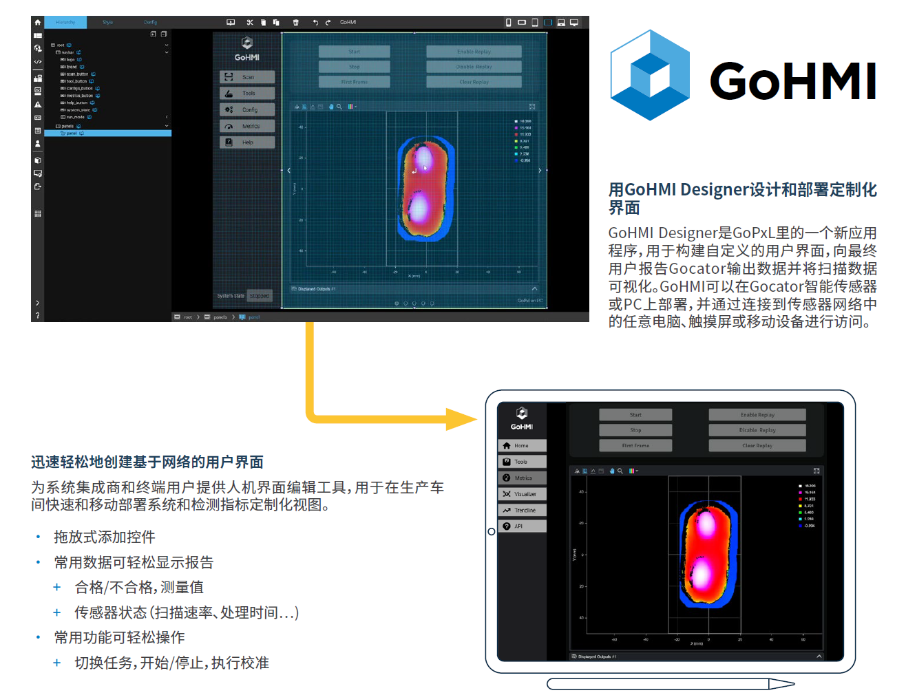
        

        
<i>支持部署在传感器/PC 端，全面适配移动与桌面设备</i>

    

=== "📊 双向交互与数据看板"
    
不仅是展示，更是强大的控制中枢

    
    * **多维度数据报告**：能够将复杂的数据转化为直观的工厂看板，轻松报告良率统计以及传感器实时健康状态等常用数据。
    * **3D 扫描可视化**：支持在监控大屏中直接将产品的轮廓或 3D 点云扫描结果进行动态可视化展示。
    * **直接反向控制**：除了查看数据，看板还可以成为操作中心。用户能通过界面按钮轻松执行一键切换配方、开始/停止扫描以及执行设备校准等。

    

        

            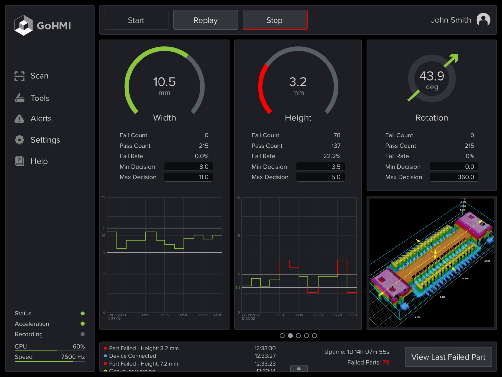
        

        
<i>直观的 GoHMI 示例：实现良率统计、3D 显示与反向控制</i>

    

### **🏭 丰富的工业通讯协议**

GoPxL 内置了主流工业协议，确保与 PLC 和机器人系统的无缝对接。

标准协议与开发接口

* **标准协议**：原生支持 EtherNet/IP, Modbus TCP, PROFINET, Ethernet ASCII。
* **开发接口**：提供 GDP 协议、GoPxL SDK 和 REST API，便于开发自定义客户端。

    

        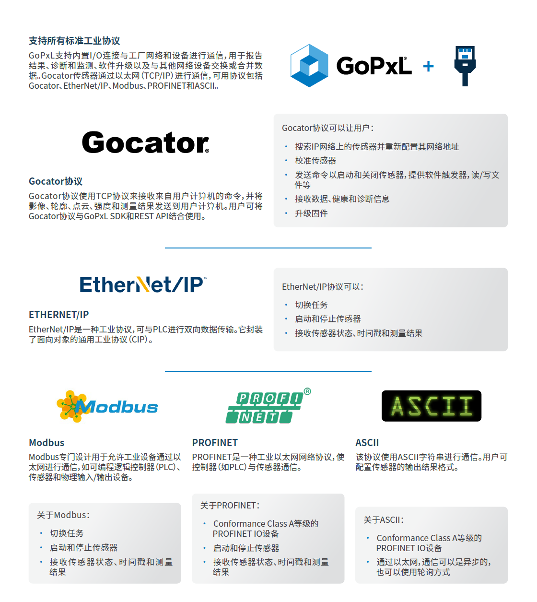
    

    
<i>GoPxL 工业通讯与数据流架构示意图</i>

## 2. 行业应用与市场

### 🏭 核心目标行业

| 行业 | 典型应用场景 |
| :--- | :--- |
| **汽车与新能源** | 引擎缸体检测、焊缝引导、动力电池在线检测、孔位标定。 |
| **3C 电子/半导体** | PCB 板检测、连接器引脚测量、手机显示屏多层材料缺陷检测。 |
| **医疗与食品包装** | 医疗包装完整性检测、包装盒空隙测量、食品质量与色彩验证。 |
| **通用制造** | 木板质量检测、线缆表面污损检测、紧固件三维尺寸测量。 |

## 3. 👥 适用用户群体

GoPxL 凭借其高扩展性和直观的用户体验，主要面向以下三类核心群体：

!!! example "终端用户与制造商"
    适用于需要可靠、灵活且易于维护的视觉系统，并希望系统能够随着生产需求变化而灵活扩展的企业。

!!! example "系统集成商 (Integrators)"
    适用于追求快速部署、跨工位便捷扩展的团队。利用内置硬件加速特性，部分场景下甚至无需额外配置工控机（PC）即可完成部署。

!!! example "Gocator® 传感器现有用户"
    适用于需要在同一 3D 生态系统内增加 2D 检测功能，或希望升级原有 Gocator 固件以获取更强大 AI 及数组工具的用户。

## 4. **🎯 GoPxL Pro Tools 功能介绍**

GoPxL Pro Tools 是 LMI 推出的进阶功能套件。从原型开发到量产，它通过引入基于 AI 的高级视觉引擎和全面的 2D 图像处理工具，在生产现场可即时优化并执行以下核心任务：

---

!!! quote "🤖 AI 异常检测 (Anomaly Detector)"
    
突破传统限制，让 AI 学习“合格”标准

    该工具集同时支持 **2D 图像 (Image)** 和 **3D 点云 (Surface)** 数据。它突破了传统尺寸测量的限制，通过让 AI 学习典型的“合格 (OK)”和“不合格 (NG)”样本来训练模型，从而精准回答 **“这件产品正常吗？”** 的问题。它能灵活识别复杂表面上随机出现的缺陷，如划痕、污染、凹陷或材质破损等。

!!! quote "🧠 AI 图像分类与目标检测 (Classify & Object Detection)"
    
赋予机器强大的认知与识别能力

    除了找瑕疵，Pro Tools 还具备强大的认知能力：
    
    * **分类工具 (Classifier)**：能够对整张图像进行评估，判断 **“这是什么产品？”**（例如在食品加工中自动区分不同种类的加工件）。
    * **目标检测 (Object Detection)**：能够进一步识别并定位视野中 **“有哪些特征”以及“它们在哪里”**，全面提升复杂场景下的检测能力。

!!! quote "👁️ 全面的 2D 图像特征定位与分析 (Image Tools)"
    
解锁全套 2D 视觉算法库

    Pro Tools 解锁了 GoPxL 中所有的 2D 图像工具。结合 2D 智能相机或由 3D 转换而来的图像数据，您可以执行图像滤波、Blob 斑点分析、边缘检测以及图像模式匹配 (Image Pattern) 等高级工具，即使在密集的电路板或复杂的组件上，也能高精度定位零件特征。

!!! quote "📑 强大的 OCR 与读码追溯 (Barcode & Matrix Code)"
    
高速识别与质量评估双重保障

    作为 2D 图像工具库的重要组成部分，Pro Tools 提供高速的条码/二维码读取以及 OCR（光学字符识别）功能。系统不仅能解码字符串，还能根据 ISO 15416 / ISO 29158 等标准对条码的打印质量进行评估 (Grading)，在满负荷生产速度下满足工厂严苛的追踪溯源需求。

---

!!! info "下一步建议"
    如果您已经了解了 GoPxL 的基本概况，建议前往 [**快速上手**](gopxl_quickstart.md) 章节开始您的第一个视觉任务配置。