# GoPxL 扫描成像与采集配置

只有获得高质量的原始图像或点云，后端的测量工具才能准确工作。在 GoPxL 中，**Acquire (采集)** 页面是配置传感器成像质量、触发逻辑以及空间坐标校准的核心控制台。该页面的设置分为两部分：适用于整个传感器组的全局设置（默认显示为 Gocator 0），以及适用于组内单个传感器的独立属性（Sensor Properties）,本章节着重介绍单传感器系统的全局设置和传感器参数设置，并详细介绍如何选择合适的参数采集良好的点云数据。

---

    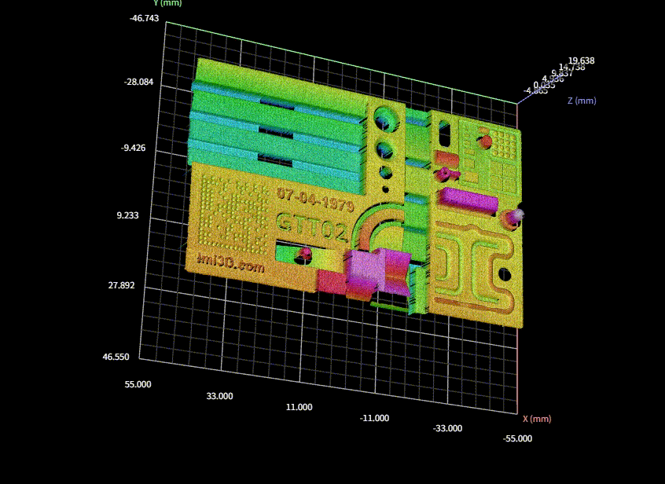
    
本章节将以图示Demo点云作为案例

## 1. 采集模式 (Scan Mode)

    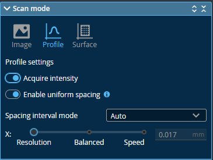

在开始配置前，首先需要确定传感器的运行模式：

=== "**Image (图像模式)**"

    输出 2D 灰度视频图像。通常用于前期安装调试、调节曝光时间，以及排查环境杂散光问题。

    

        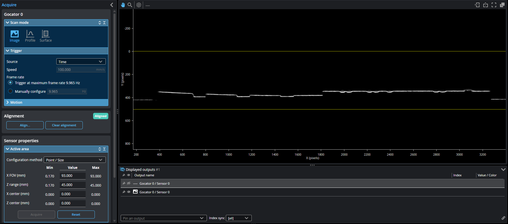
        
影像模式

    

    在图像模式下，数据查看器直接显示来自传感器的原始影像，基于不同的传感器型号，用户可以通过数据查看器分析选择有效点和数据缺失，以确保数据采集的图像质量。
    

        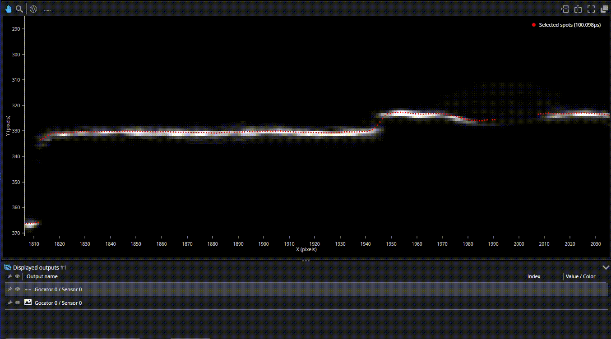
        
显示有效点

    

=== "**Profile (轮廓模式)**"

    输出 2D 截面轮廓线，内部自动处理视频图像以生成轮廓数据，用于截面测量。

    

        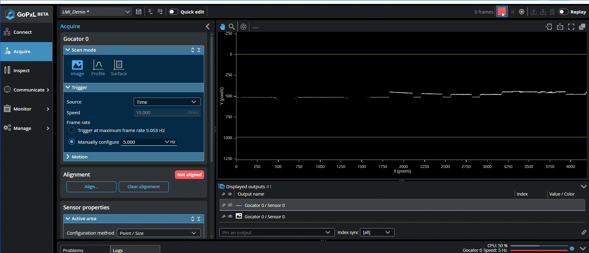
        
从影像模式切换至轮廓模式

    

=== "**Surface (表面模式)**"

    通过移动拼接输出 3D 点云或高度图。针对不同的运动场景，GoPxL 提供了四种表面生成方式：
    
    * **Fixed Length (固定长度)**：生成指定固定长度的表面。
    * **Variable Length (可变长度)**：在外部数字输入信号保持高电平时连续采集，信号变低或达到最大长度时结束，适用于机械臂抓取等场景。
    * **Rotational (旋转)**：专为扫描圆形物体（如轮胎、瓶子）设计，表面数据会根据编码器的索引脉冲（Index Pulse）自动对齐起点。
    * **Continuous (连续)**：连续输出数据，通常配合"零件检测 (Part Detection)"功能使用，以便在传送带上分离出独立的零件。
    
    

        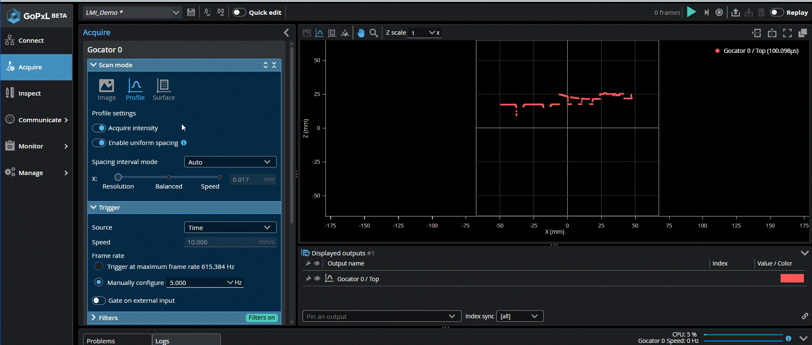
        
采集点云数据

    

### 1.1 数据格式：Uniform 与 Point Cloud

* **Enable Uniform Spacing (启用均匀间距)**：在轮廓模式和表面模式下可以 启用/禁用 均匀点间距，传感器会将原始点云重新采样（Resample）为具有固定 X 轴间距的均匀网格数据。这是使用大多数 3D 测量工具和滤波器（如中值滤波、孔洞填补）的前提。
* **Point Cloud (点云)**：禁用均匀间距时，输出最原始的点云数据，此时传感器能以最高帧率运行，但不适用于所有测量工具。

    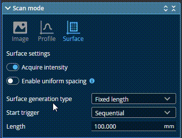
    
启用 Uniform Spacing

!!! tip "关于均匀间距"
    在启用均匀间距后, 同一列Z方向仅存在唯一的数据有效点, 若需同时扫描Z方向多层数据，需要禁用该选项。

### 1.2 采集亮度
* **Acquire Intensity (采集亮度)**：在轮廓和表面模式下可以 启用/禁用 亮度采集的功能。

    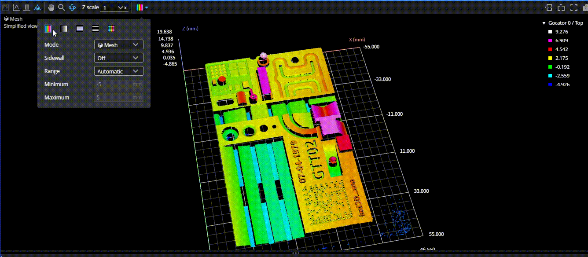
    
点云亮度信息辅助分析表面细节和曝光调试

### 1.3 设置X点间距
* **Spacing interval mode (点间距)** ：基于不同型号的传感器，在激光X方向的默认点间距各不相同，用户可根据实际需求修改点间距。

    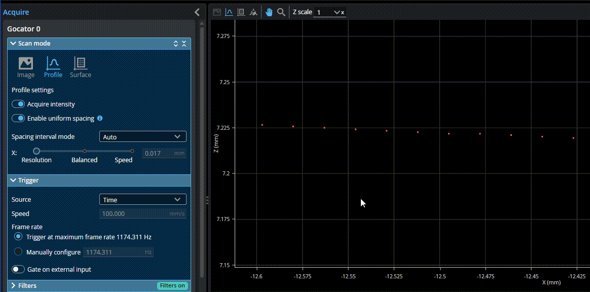
    
修改X点间距

<!--div style="background: #fff3cd; border: 1px solid #ffc107; border-radius: 6px; padding: 16px; margin: 20px 0; display: flex; align-items: flex-start;">
  
⚠️

  

    <b style="margin: 0 0 8px 0; color: #856404;">警告标题</b>
    
这是详细的警告内容，可以包含多行文本。 第二行警告信息。

  

</div-->
<!--div style="background: #f8d7da; border-left: 4px solid #dc3545; color: #721c24; padding: 12px 16px; border-radius: 4px; margin: 16px 0;">
  <strong>❌ 错误：</strong>发生了一个错误，请检查后重试。
</div-->
---

## 2. 曝光设置 (Exposure Setting)

曝光决定了传感器接收反射光的量。正确的曝光对于生成精确的 3D 点至关重要。你可以在 **Sensor Properties > Exposure** 中为每个传感器独立设置。

### 2.1 曝光模式
* **Single (单曝光)**：设置一个固定的曝光时间，适用于表面材质和反光率均一的物体。
* **Multiple (多曝光)**：允许设置多达 5 个不同的曝光时间（G3 传感器为 3 个）。传感器会合并这些曝光数据，非常适用于同一个视野内既有深色吸光材料、又有高反光金属的复杂工件。
* **Dynamic (动态曝光)**：传感器会根据前一帧的分析结果，在设定的最小和最大阈值范围内自动调整下一帧的曝光。

    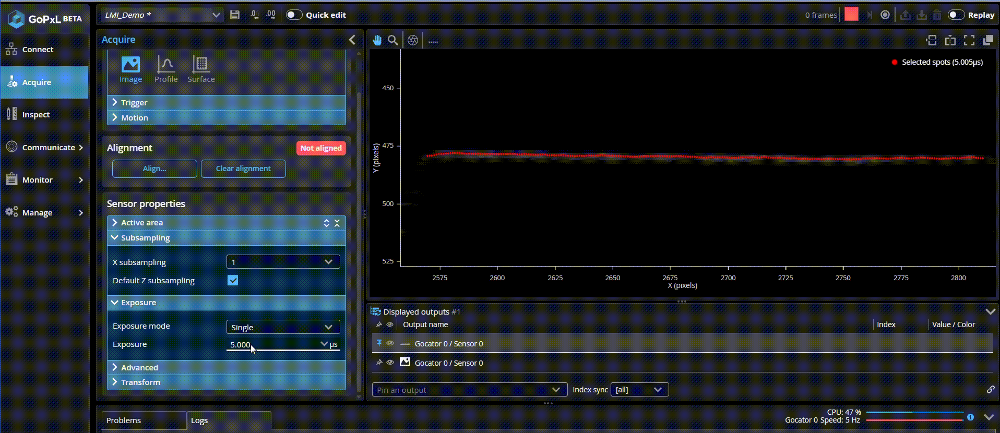
    
修改曝光参数

    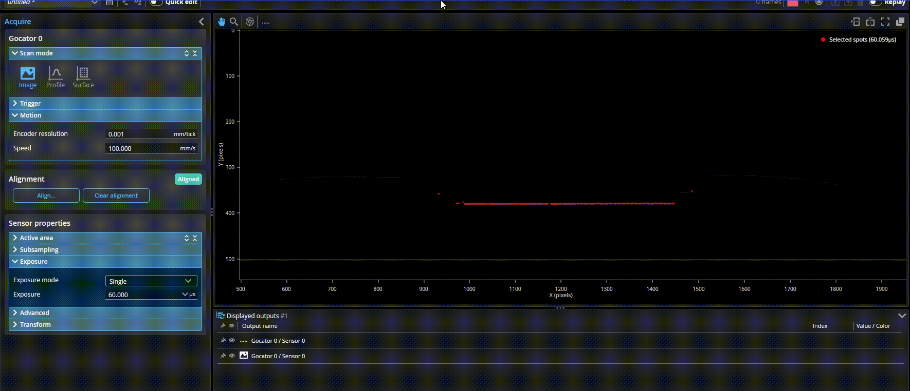
    
多曝光兼容金属表面(中间) 和低反射表面(两侧)

 

!!! tip "多曝光的影像"
    在使用多曝光后，传感器的采样帧率会有所降低，实际使用时应考虑对CT的影响。

### 2.2 高动态范围 (HDR)

Gocator 2600 提供了在 **Advanced (高级)** 菜单中的 **HDR 模式**。开启后，传感器在内部对视频图像应用伽马曲线压缩高强度值，从而在单次曝光下就能大幅提升动态范围。这可以在不牺牲扫描帧率（相比多曝光模式）的情况下，有效扫描闪亮的金属部件。

!!! tip
    "HDR" 模式 (仅限 Gocator 2600 系列)。

### 2.3 Digital gain (数字增益)
数字相机增益可在应用严重受曝光限制而动态范围不是关键因素时使用。通常取值 1 适用于大多数应用，范围为 0 到 8。当检测信号非常弱时可以增加数字增益以提高灵敏度，但增益增加会同时增大噪声。

    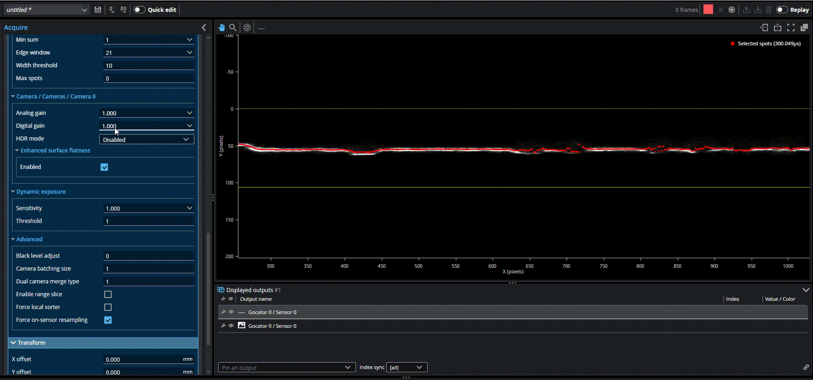
    
修改数字增益的影像效果

---

## 3. 触发与运动 (Triggering & Motion)

### 3.1 运动参数设置 (Motion)
如果您使用编码器，必须在 **Motion** 面板中准确输入 **Encoder Resolution (编码器分辨率)**，单位为 mm/tick（每脉冲毫米数）。如果使用时间触发，则需要输入传送带的实际 **Speed (移动速度)** 。准确的运动设置是保证 Y 轴测量精度的基石。

    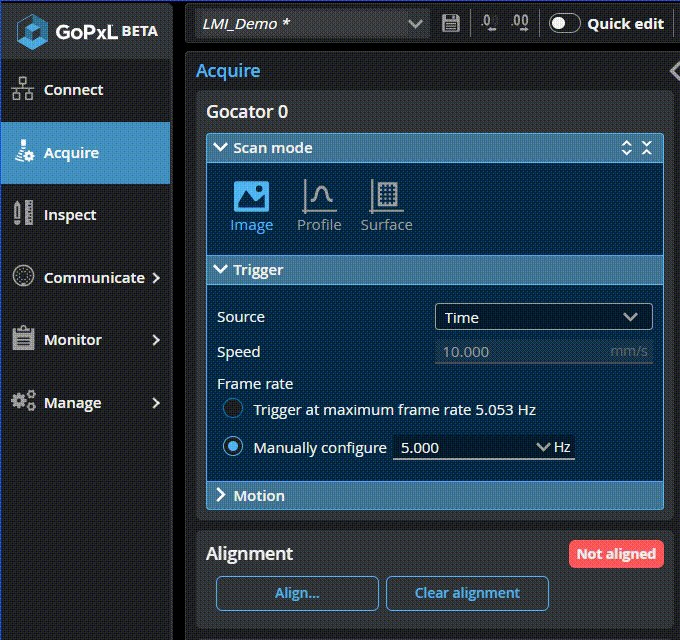
    
修改编码器的分辨率

!!! tip "运动参数设置"  
    编码器分辨率设置对应编码器触发模式， 速度设置对应时间模式，在不同模式下该两项配置互不影响。

### 3.2 触发源 (Trigger Source)
在 **Trigger** 面板中，您可以选择以下触发方式：

* **Time (时间触发)**：利用内部时钟按固定的频率（Hz）进行连续扫描。常用于传感器静止、物体匀速运动的场景。
* **Encoder (编码器触发)**：根据外部编码器的脉冲进行扫描。这是传送带扫描最常用的方式，能确保 3D 模型在 Y 轴（运动方向）不失真。编码器触发支持三种逻辑：
    * **Track Backward (追踪后退)**：当传送带倒退时停止扫描，直到它再次前进并越过之前倒退的距离后才恢复。
    * **Ignore Backward (忽略后退)**：仅在向前运动时触发。
    * **Bi-directional (双向)**：无论前进还是后退都触发扫描。
* **External input (外部触发)**：基于接入的IO脉冲信号触发数据采集。
* **Software (软件触发)**：由上位机或PLC通过软件接口触发固定长度的点云数据采集。
  
### 3.3 设置运动方向采样间距(Y方向点间距)
在Encoder触发方式下，用户可自定义运动方向的数据采集点间距：

    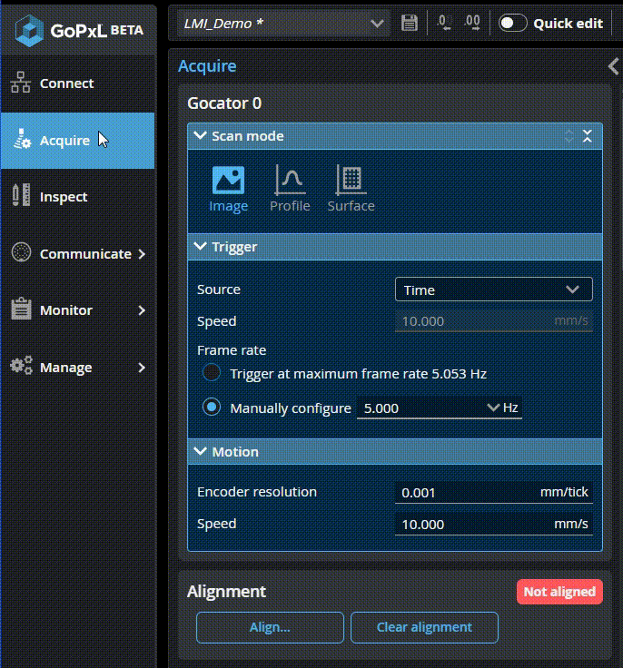
    
修改Y方向点间距

---
### 4. 滤波
=== "**Gap Filling (补缺)**"

    当由于遮挡导致数据缺失时，使用相邻数据点的信息来填补丢失的数据。补缺还能填充那些检测不到数据的空白，这可能是由于表面反射率低（例如黑色或镜面区域），或者表面本身存在实际的空洞。
    "Filter in X"和"Filter in Y"中的值表示传感器能够填补的最大间隙，超过该范围的间隙将不会被填充。补缺通过在指定窗口内使用最近邻点的最低值或在相邻值之间进行线性插值来填补缺失数据点（取决于相邻点之间的 Z 方向差异）。传感器可以沿 X 轴和 Y 轴填充间隙。
    在轮廓模式（Profile）中，补缺仅限于 X 轴
    

        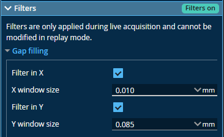
        

    

=== "**Median（中值）**"

    将数据点的值替换为在该数据点周围由 X Window Size 或 Y Window Size 设置的窗口内计算得到的中值。若窗口大小为偶数，则输出位置相对于中心向右偏移 0.5 个像素。
    

        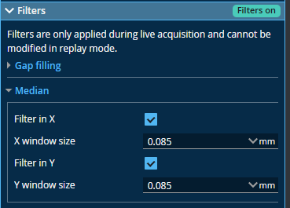
        

    

=== "**Smoothing（平滑）**"

    平滑滤波 将数据点的值替换为该点与其在 X Window Size 或 Y Window Size 所定义窗口内最近邻点的平均值。X 方向平滑通过在同一轮廓线上的样本间计算移动平均实现。Y 方向平滑则在每个 X 位置沿运动方向计算移动平均。若同时启用了 X 和 Y 平滑，数据先沿 X 轴平滑，再沿 Y 轴处理。缺失的数据点不会被周围点计算出的平均值所填充。
    

        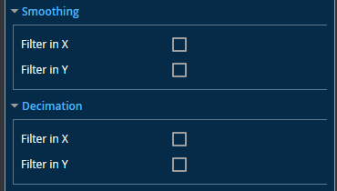
        

    

=== "**Decimation（抽稀/降采样）**"

    降采样 通过在 X 轴或 Y 轴上为每个数据点选择其指定窗口末端的点来减少点数。例如，将 X Window Size 设为 0.2 时，只有每 0.2 毫米的点会被保留。该滤波器从扫描数据的最左端开始生成点，并以相等间隔向右（或运动方向）逐步选取。
    

        
        

    

!!! tip "注意滤波参数设置"
    设置过高的滤波参数会导致数据失真，导致扫描产品的实际特征丢失。在一般应用案例中，Gap Filling和中位数滤波应设置为3~5个点距，平滑滤波应基于检测项目的实际情况评估

## 4. 扫描区域与降采样 (Active Area & Subsampling)

通过限制传感器的视野（FOV），可以大幅减少处理数据量并提升性能。

* **Active Area (有效区域)**：在传感器属性中，您可以裁剪 X 轴视野（X FOV）和 Z 轴测量范围（Z Range）。    
* **Subsampling (子采样)**：通过减少用于数据采集的相机行/列数，在保持视野不变的情况下降低数据密度，从而提高扫描速度并降低 CPU 占用。

!!! tip "帧率优化秘籍"
    缩小 **Z 轴** 的搜索窗口是提升传感器最高扫描频率最有效的方法。如果您不需要用到传感器的全部量程，请尽量缩小 Z Range 并将其贴近工件实际高度。

以下演示了用户分别通过 **缩小有效区域**、**减小曝光参数**、**降采样**逐步将采样帧率由 4.6kHz 提高到13.5kHz的过程:

    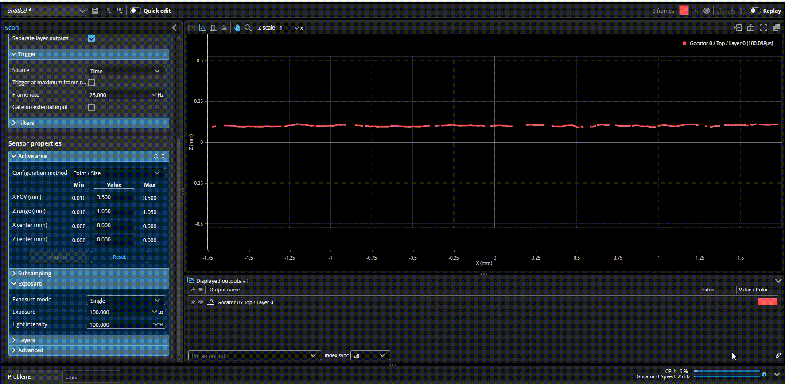
    
提高扫描帧率

---

## 5. 传感器校准 (Alignment)

传感器校准（Alignment）旨在补偿传感器安装时产生的物理偏差（如倾斜、旋转），将数据从“传感器内部坐标系”转换为物理世界的“系统坐标系”（例如以传送带表面为 Z=0 平面）。未校准的传感器可能会输出倾斜或拉伸失真的数据，导致测量不准。

以下展示了最常用的校准，将非0的斜面校准为Z=0的水平参考面：

    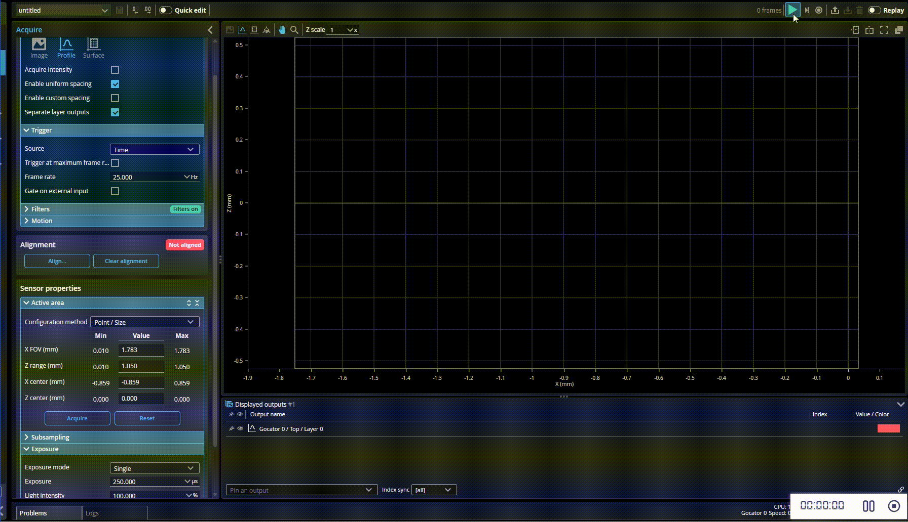
    
传感器校准

### 5.1 常用向导校准 (最高 5 自由度)
GoPxL 在 Acquire 页面提供了一个非常直观的校准向导（点击 **Align...**），支持以下标定靶：
* **Stationary Flat Surface (静止平面)**：最基础也最常用的方法。直接对着静止的传输带或加工平台扫描，校正 Z 轴原点以及 X 轴/Y 轴的倾斜角。
* **Stationary / Moving Bar (校准杆)**：使用标准机加工的矩形杆，不仅能校正高度和倾斜，还能解决多传感器拼接时的 Y 轴偏移和 Z 轴旋转（偏航角）问题。
* **Polygon (多边形靶标)**：用于多传感器环形包围（360度扫描）布局。

### 5.2 高精度工具校准 (6 自由度)
对于 G2 系列传感器且需要极高精度的 6 自由度（包含 X 轴旋转补偿）拼接，需要使用专门的测量工具进行校准：
* **Surface Align Wide**：用于并排多传感器宽视野拼接，需要使用定制的金字塔阵列标定板（Truncated Pyramids）。
* **Surface Align Ring**：用于环形布局拼接，使用双面截头金字塔标定靶。
!!! tip "提示"
    使用工具校准时，必须先在 Acquire 页面点击 **Clear Alignment (清除校准)**，确保传感器处于未校准的原始坐标状态。

---
## 6. 高级参数

### 6.1 材料类型
在实际应用中，针对不同的材质应选择不同的采集参数，Gocator传感器默认采用 “Diffuse(漫反射)”，在复杂材质（如高反射，半透明等）表面一般需要使用“Custom(客制化)”采集参数。

    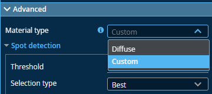
    
基于材料选择高级参数

### 6.2 选点方式
* **Best(最佳)**：有效点选择方法在成像器的给定列中选择最佳或峰值有效点。
* **Top(顶部)**:顶部选择最高有效点。这些选项在激光一侧始终有反射、飞溅火花或烟雾的应用中非常有用。
* **Contunity(连续性)**:连续性选择模式考虑成像器上的相邻水平数据点，以在像素上放置有效点，优先选择更完整的轮廓段。该
设置可在存在反射和噪声的情况下改善扫描效果。
* **None(无)**:该选择模式不执行有效点过滤。如果在成像器列中检测到多个有效点，它们将保持原样。此选项仅在扫描页面上的扫描模式面板中禁用均匀间距时显示；

以下案例演示了在透明材料上下层数据间，切换**Best**和**Top**选点:

    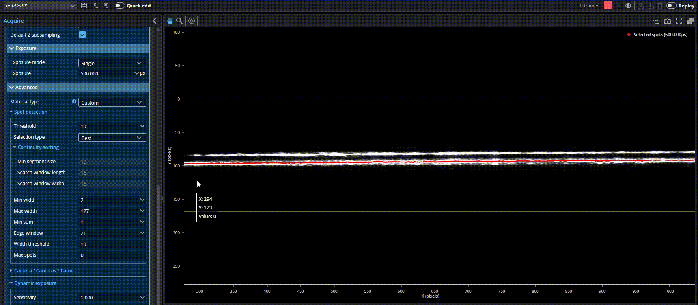
    
基于多层数据配置选点模式

## 7. 故障排查 (Troubleshooting)

### 为什么扫描出的点云有“空洞”或红/蓝斑点？
1. **曝光不当**：切换到 **Image 模式** 观察。蓝色像素代表欠曝，红色像素代表过曝或饱和（导致无法生成 3D 点）。请调整 Exposure 时间或开启 Multiple 多曝光。
2. **遮挡 (Shadowing)**：调节传感器安装角度，避免激光线被工件自身的陡峭边缘挡住相机视线。
3. **材质吸光**：检查被测物是否是黑色橡胶等强吸光材质，如果是，需在 **Advanced > Material type** 中尝试调整或增大曝光。

### 为什么画面有拖影或比例拉伸变形？
1. **触发与速度不匹配**：如果是时间触发，检查工件的实际运动速度是否与设定的 Speed 匹配。如果是编码器触发，检查 Encoder Resolution 换算是否正确。
2. **Z Angle 误差**：如果扫描出的长方形变成了一个斜的平行四边形（X 轴方向有明显的倾斜拉伸），通常是因为传感器安装时存在偏航角（Z Angle）。请使用 Bar（校准杆）执行一次对齐校准来消除该余弦误差。