# GoPxL 工具与测量 (Inspect)


??? quote "📝 手册更新日志 (Changelog)"
    
    | 说明书版本 | 更新日期 | 更新者 | 更新说明 |
    | :--- | :--- | :--- | :--- |
    | **V1.0** | <code style="white-space: nowrap;">2026-03-13</code> | <span style="white-space: nowrap;">**Donnie&nbsp;Dong**</span> | 初始版本，完成基础测量工具详解 |

---
在 GoPxL 中，**Inspect (检测)** 页面是实现核心检测逻辑和尺寸测量的地方。在这里，您可以添加各种测量和处理工具，将原始的 2D 轮廓或 3D 曲面转化为具体的测量数值（如长、宽、高、半径）以及 Pass/Fail 判定结果。

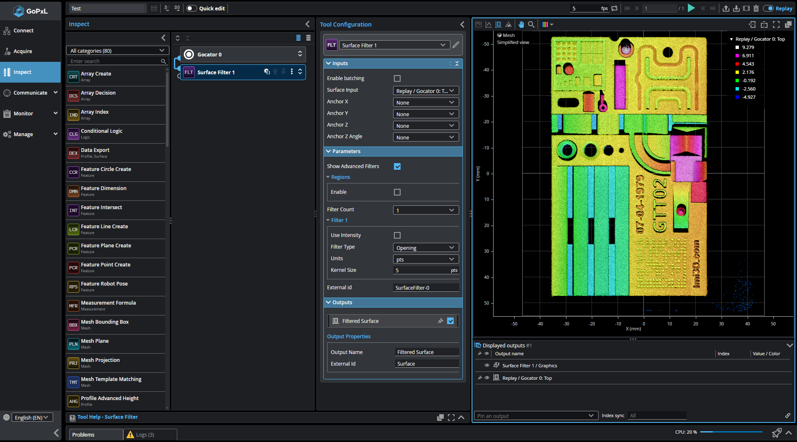{: style="display: block; margin: 0 auto; width: 100%; border-radius: 8px; box-shadow: 0 4px 15px rgba(0,0,0,0.1);" }

<p align="center" style="color: #666; font-size: 14px; margin-top: 10px; margin-bottom: 20px;">GoPxL Inspect 页面区域划分</p>


---

## 1. 核心概念 (Core Concepts)

在使用具体工具之前，理解以下几个 GoPxL 的核心机制至关重要。

### 1.1 工具链 (Tool Chaining)
GoPxL 的测量工具具有高度的灵活性，它们可以像积木一样连接在一起：**一个工具的输出可以作为另一个工具的输入**。
在中间的 **Tool Diagram (工具图)** 面板中，蓝色的连线清晰地展示了数据的流向。例如，您可以先用“曲面滤波 (Surface Filter)”工具平滑点云，然后将滤波后的输出传递给“曲面尺寸 (Surface Dimension)”工具进行测量。

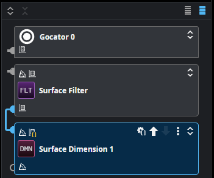{: style="display: block; margin: 0 auto; border-radius: 8px;" }

<p align="center" style="color: #666; font-size: 14px; margin-top: 10px; margin-bottom: 20px;">通过连线实现工具间的数据传递</p>

### 1.2 几何特征 (Geometric Features)

很多工具除了输出具体的数值（如半径 10.5 mm）外，还会输出在 3D 空间中的**几何特征**，例如点 (Point)、线 (Line)、圆 (Circle) 或平面 (Plane)。

这些几何特征本身不是最终的测量结果，但它们相当于空间中的“骨架”。在后续的高阶应用中，这些特征可以作为输入，传递给后端的 **特征 (Feature)** 工具进行复杂的空间几何计算。

**📌 简单示例：**
例如，当您使用 `曲面圆孔 (Surface Hole)` 工具检测一个圆孔时，工具不仅会输出孔的半径，还会输出一个**点特征 (Center Point)**。这个“点”记录了孔心的精确 X/Y/Z 坐标，并会直观地渲染在 3D 视图中，作为后续分析的绝佳基准。

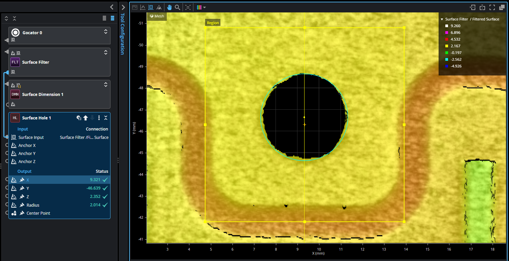{: style="display: block; margin: 0 auto; border-radius: 8px;" }

<p align="center" style="color: #666; font-size: 14px; margin-top: 10px; margin-bottom: 20px;">曲面圆孔 工具在 3D 视图中输出的“点”特征</p>

### 1.3 锚定 (Measurement Anchoring)

在实际生产线上，被测物体每次到达扫描区域时的位置和角度往往都会有偏差。**锚定 (Anchoring)** 就是为了解决这个“位置不固定”的核心功能。

它巧妙地利用了我们在上一节提到的**几何特征**（例如一个稳定的中心点，或一条笔直的边沿）作为参考基准。当您将测量工具“锚定”在这个基准上时，奇妙的事情就会发生：

无论零件如何平移或旋转，测量工具的**感兴趣区域 (Region)** 都会像磁铁一样，智能地跟随目标特征移动。这意味着系统始终能在正确的位置执行测量。

!!! tip "一劳永逸的配置"
    只要设置好锚定，您就不需要为物体位置的随机变化而反复去手动调整测量框，这极大地提升了检测程序的稳定性和适应性。

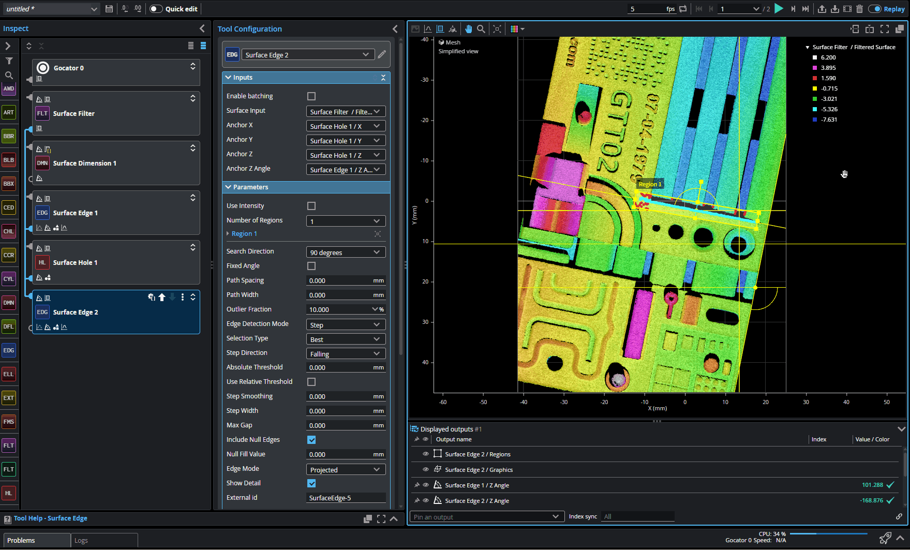{: style="display: block; margin: 0 auto; border-radius: 8px; box-shadow: 0 2px 10px rgba(0,0,0,0.1);" }

<p align="center" style="color: #666; font-size: 14px; margin-top: 10px; margin-bottom: 20px;">测量区域智能跟随锚定点的平移与旋转</p>

### 1.4 感兴趣区域 (Regions of Interest)
绝大多数工具都允许您开启 **Use Region (使用区域)** 选项，以限制工具只处理视野中的特定部分数据。
* **标准区域 (Standard Regions)**：支持矩形/长方体边框。
* **灵活区域 (Flexible Regions)**：支持圆形 (Circle)、椭圆 (Ellipse) 以及多边形 (Polygon) 等。

---

## 2. 工具分类概览 (Tool Categories)

GoPxL 提供了多达上百种内置测量与处理工具。为了方便检索和管理，系统根据**处理的数据类型**和**功能逻辑**，将这些工具主要划分为以下几大类：

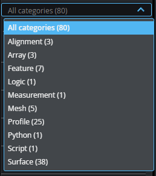{: style="display: block; margin: 0 auto; border-radius: 8px; margin-bottom: 20px;" }

<div class="grid cards" markdown="1">

-   :material-chart-bell-curve-cumulative:{ .lg .middle } __轮廓 (Profile)__
    ---
    专门用于处理 2D 截面数据。常用于测量截面的面积、台阶高度、夹角角度等 2D 维度尺寸。

-   :material-cube-outline:{ .lg .middle } __曲面 (Surface)__
    ---
    核心的 3D 处理工具组。用于处理完整的 3D 点云或高度图数据，可执行复杂的空间测量，如计算体积、平面度、圆柱度、3D 间隙与段差等。

-   :material-vector-point:{ .lg .middle } __特征 (Feature)__
    ---
    基于输入的空间几何特征（如点、线、平面）进行二次计算。例如测量两个圆心之间的距离，或通过两条线相交创建一个新的交点特征。

-   :material-view-grid-plus-outline:{ .lg .middle } __阵列 (Array)__
    ---
    用于处理包含多个元素的数据集。例如将同一视野中检测到的多个零件结果打包成阵列数据，或者从一组高度数据中提取特定索引的最大/最小值。

-   :material-code-braces:{ .lg .middle } __Script / Python__
    ---
    属于高级自定义工具。当标准测量工具无法满足特殊需求时，可使用这些工具编写自定义的数学运算表达式 (Logic) 或复杂的 Python 逻辑判定 (Script)。

</div>

---

## 3. 常用基础工具详解

GoPxL 提供了丰富的 3D 测量工具。为了帮助您快速理解，我们以一个包含多种特征的**标准测试块**为例，为您演示 6 个最常用的基础曲面测量工具， 2 个轮廓测量工具及 1 个高级脚本工具的实际应用。

---

### 3.1 曲面尺寸 (Surface Dimension)
**功能说明**：用于测量 3D 空间中两个指定特征点之间的相对距离，以及在 X、Y、Z 三个轴向上的投影差值。

**📌 实战演示**：
要测量测试块上“最高圆柱体”到“下方圆孔”的距离，您可以：
1. 将 **特征 1 (Feature 1)** 定位在最高圆柱体上，类型选择为 `Max Z (最大 Z 值)`。
2. 将 **特征 2 (Feature 2)** 定位在下方圆孔区域，类型选择为 `Centroid (中心点)`。
工具会自动在 3D 视图中绘制出这两点之间的空间连线并输出精确距离。

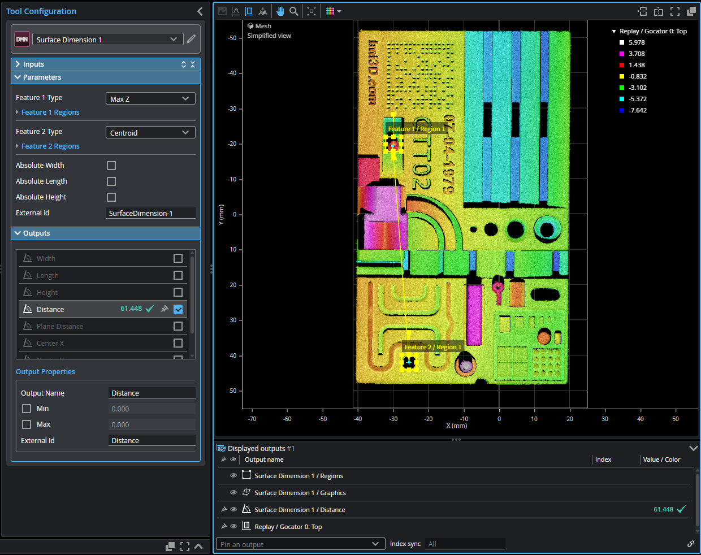{: style="display: block; margin: 0 auto; border-radius: 8px;" }

<p align="center" style="color: #666; font-size: 14px; margin-top: 10px; margin-bottom: 20px;">测量圆柱顶点到圆孔中心的空间距离</p>

### 3.2 曲面圆孔 (Surface Hole)
**功能说明**：精准定位并测量 3D 数据中的圆孔。输出孔的半径 (Radius) 以及孔心坐标 (X, Y, Z)，孔心坐标常被用作后续测量的基准点。

**📌 实战演示**：
我们将测量区域（Region）框选在测试块左下角的独立圆孔上。

!!! tip "避坑指南：开启参考区域"
    由于孔洞周围的曲面可能存在加工公差或倾斜，强烈建议开启 `Use Reference Region`。这会在孔的外围生成一个参考框，利用孔洞边缘一小圈的平整曲面作为“零位基准面”，从而计算出最真实的孔深。

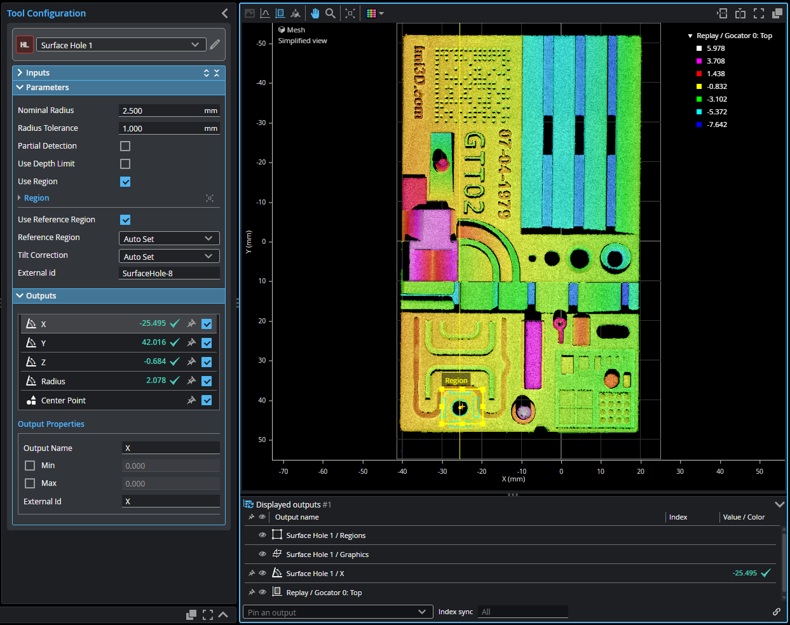{: style="display: block; margin: 0 auto; border-radius: 8px;" }

<p align="center" style="color: #666; font-size: 14px; margin-top: 10px; margin-bottom: 20px;">自动定位孔心、拟合边界并建立深度参考面</p>

### 3.3 曲面边界框 (Surface Bounding Box)
**功能说明**：计算包围整个 3D 对象或局部特征的最小外接矩形。这是建立全局坐标系、实现“测量框自动跟随”的最常用定位工具。

**📌 实战演示**：
我们直接全局框选整个测试块。工具会立刻输出一个紧贴测试块外轮廓的边界框，并在中心生成一个坐标系图标。它输出的中心点 (Center X/Y) 和旋转角度 (Z Angle) 即可作为后续所有工具的“锚定 (Anchor)”基准。

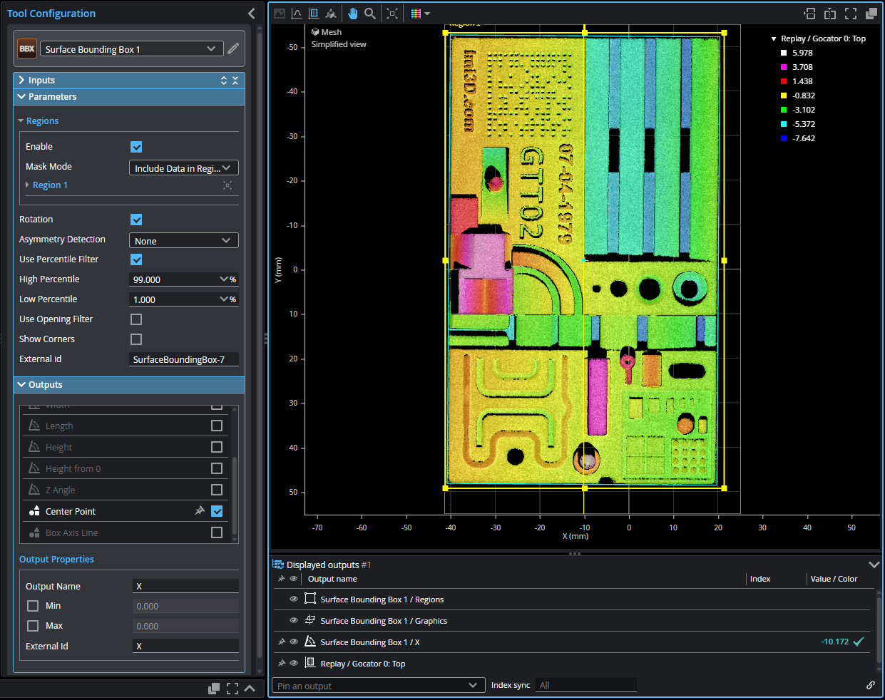{: style="display: block; margin: 0 auto; border-radius: 8px;" }

<p align="center" style="color: #666; font-size: 14px; margin-top: 10px; margin-bottom: 20px;">获取零件的整体中心点与旋转角度，用于全局锚定</p>

### 3.4 曲面边沿 (Surface Edge)
**功能说明**：在 3D 曲面上寻找并提取笔直的边沿线。提取出的“线 (Line)”特征可用于计算零件偏转角，或测量点到线的垂直距离。

**📌 实战演示**：
将工具的搜索区域（带方向箭头的矩形框）放置在测试块右上角长条凹槽的垂直长边上。请确保搜索方向箭头垂直指向该边沿。工具会自动拟合出一条精准的彩色直线。

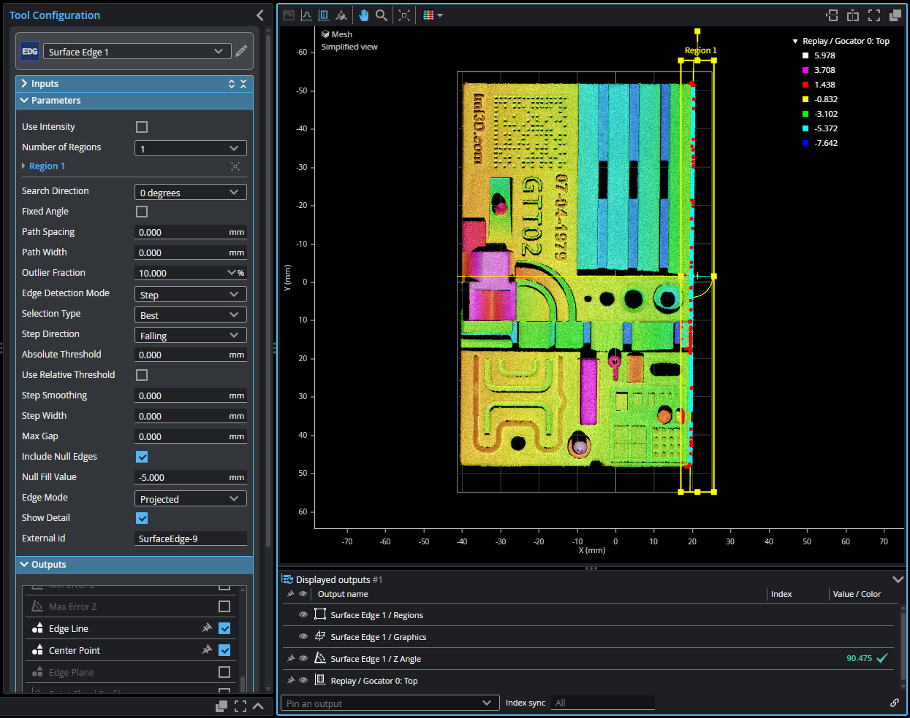{: style="display: block; margin: 0 auto; border-radius: 8px;" }

<p align="center" style="color: #666; font-size: 14px; margin-top: 10px; margin-bottom: 20px;">在指定搜索区域内精准提取直线边沿特征</p>

### 3.5 曲面位置 (Surface Position)
**功能说明**：在指定的 3D 区域内，快速寻找一个特定的极值点（如最高点、最低点、中心点），并精准输出该点的 X、Y、Z 绝对坐标。

**📌 实战演示（寻找零件最高点）**：
这个工具是 3D 测量中最稳定、最常用的“寻点神器”。假设我们需要找到测试块上凸起结构的最高点坐标：
1. **框选目标**：将测量区域 (Region) 框在测试块左侧那个最明显的紫红色凸起结构上。
2. **选择特征**：在工具参数中，将要寻找的特征类型 (Feature) 设置为 `Max Z (最大 Z 值)`。
工具会瞬间在画面中最高的位置“锚”定一个十字星标记，并直接输出这个最高点的 Z 轴高度值。整个过程无需任何复杂的算法微调，极其稳定可靠。

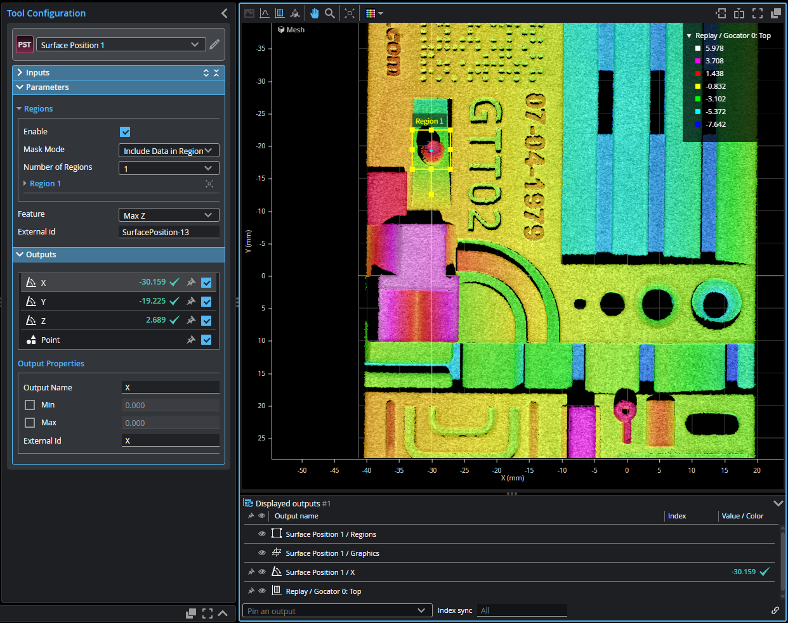{: style="display: block; margin: 0 auto; border-radius: 8px;" }

<p align="center" style="color: #666; font-size: 14px; margin-top: 10px; margin-bottom: 20px;">在目标区域内精准定位最高点并输出三维坐标</p>

### 3.6 曲面截面 (Surface Section)
**功能说明**：这是 3D 视觉中最核心的“降维提取”工具。它允许您在完整的 3D 曲面上画一条虚拟的切割线，提取出一个 2D 的截面轮廓 (Profile)。当遇到复杂的段差、间隙或装配角度时，通常会先用此工具切出截面，再将其传递给后端的 2D 轮廓工具进行超高精度的测量。

**📌 实战演示（提取阶梯截面轮廓）**：
假设我们需要分析测试块左侧阶梯结构的高度落差形态：
1. **绘制截面线**：添加工具后，在 3D 视图中拖动截面线 (Section Line)，让它垂直横跨左侧最高处的紫红色平台和紧挨着的黄绿色低平台。
2. **查看降维结果**：工具会立刻沿着这条线“切”下一刀，并输出一个包含高度和宽度的 2D 轮廓数据。您可以在数据视图中清晰地看到一个完美的阶梯状 2D 曲线。

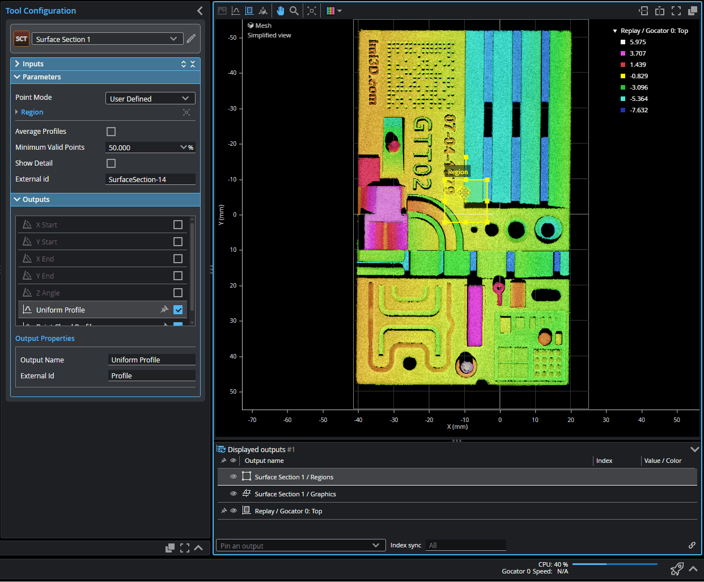{: style="display: block; margin: 0 auto; border-radius: 8px;" }

<p align="center" style="color: #666; font-size: 14px; margin-top: 10px; margin-bottom: 20px;">在 3D 点云上绘制切割线，提取出用于后续精细测量的 2D 截面轮廓</p>

### 3.7 轮廓直线 (Profile Line)
**功能说明**：专门用于在 2D 轮廓数据中寻找并拟合出一条精准的直线。它不仅能输出这条直线的角度 (Angle)，还可以作为一条“无限延伸的虚拟基准线”，供其他工具进行距离测量。

**📌 实战演示（建立阶梯上平面的基准线）**：
承接 3.6 节切出的 2D 阶梯轮廓，我们需要在最高的平台上建立一个水平测量基准：
1. **接收数据**：在工具的 Input（输入）设置中，选择接收 `Surface Section 1` 输出的 Profile 数据。
2. **框选拟合**：在 2D 数据视图中，将测量框放置在左侧较高阶梯的那段平坦轮廓线上。
工具会自动过滤噪点，在这段轮廓上紧紧“贴”上一条绿色的拟合直线，并输出该平面的倾斜角。

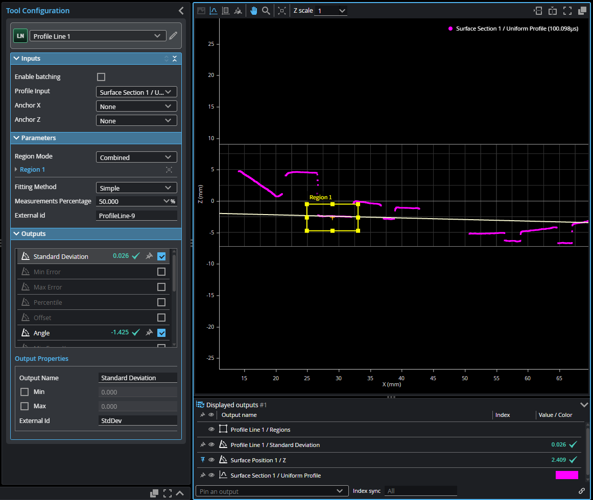{: style="display: block; margin: 0 auto; border-radius: 8px;" }

<p align="center" style="color: #666; font-size: 14px; margin-top: 10px; margin-bottom: 20px;">在 2D 轮廓的局部高台上精准拟合基准直线</p>

### 3.8 轮廓尺寸 (Profile Dimension)
**功能说明**：2D 轮廓测量的最常用基础工具。用于在同一条 2D 截面线上，通过划定两个测量区域来寻找特定特征点（如最高点、最低点、平均点），并直接计算这两个点之间的水平间距 (X) 和垂直落差 (Z)。

**📌 实战演示（计算阶梯垂直落差）**：
我们将直接在 3.6 节提取出的 2D 阶梯轮廓上，测量高低两个平台的高度差：
1. **特征 1 (Feature 1)**：将测量区域框放置在左侧较高的平台上，特征类型选择 `Average (平均点)`。
2. **特征 2 (Feature 2)**：将测量区域框放置在紧挨着较低的平台上，特征类型同样选择 `Average (平均点)`。
工具会自动提取这两个框内轮廓的平均高度，并计算它们的相对关系。您只需查看输出项中的 `Z Distance (Z 轴距离)`，即可得到阶梯的精确落差。

!!! tip "进阶思路：何时使用 特征尺寸 (Feature Dimension)？"
    如果您想利用 3.7 节拟合出的那条“无限延伸的基准线”去测量它到某个点的距离（消除平面局部倾斜误差），`Profile Dimension` 是做不到的。此时您需要添加 **Feature (特征)** 目录下的 **`Feature Dimension (特征尺寸)`**。
    在 GoPxL 中，**“用轮廓/曲面工具提取几何特征，用特征工具计算空间关系”** 是非常高阶且精准的组合玩法！

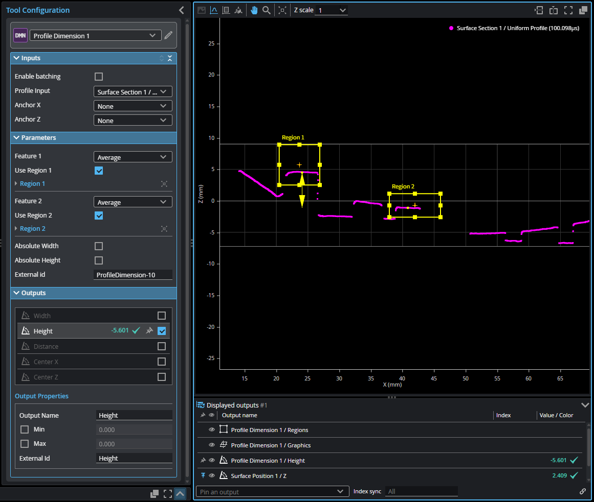{: style="display: block; margin: 0 auto; border-radius: 8px;" }

<p align="center" style="color: #666; font-size: 14px; margin-top: 10px; margin-bottom: 20px;">通过分别框选高低平台提取平均点，直接测量 2D 轮廓的垂直落差</p>

---

### 3.9 脚本工具 (Script)
**功能说明**：GoPxL 内置了 Python 3.8 引擎。当标准工具无法满足您的复杂判定逻辑（例如：需要同时结合前文测量出的“孔洞半径”和“零件最高点”进行综合良率分级）时，您可以直接编写 Python 代码来实现高级定制。

**📌 实战演示（多条件综合良率判定）**：
在进行代码编写前，我们需要先在工具左侧的 **Inputs（输入）** 面板中，将 `Input 0` 映射为孔半径，`Input 1` 映射为位置 Z 值。然后在 **Outputs（输出）** 面板中定义一个 `Output 0`，类型设为 `Measurement`。

GoPxL 的 Python 引擎通过专用的 API 函数（如 `get_measurement` 和 `send_measurement`）来与界面引脚交互。在 Script 的代码框中输入以下代码：

```python
# 1. 获取输入引脚的测量对象，并提取具体的数值 (.value)
m_hole = get_measurement(0)    # 对应 Input 0
m_height = get_measurement(1)  # 对应 Input 1

# 2. 设定生产公差范围
MIN_RADIUS = 4.0
MAX_RADIUS = 4.5
MIN_HEIGHT = 2.0
MAX_HEIGHT = 3.0

# 3. 综合逻辑判定
# 首先安全检查：确保两个测量对象都成功获取，避免报错
if m_hole is not None and m_height is not None:
    hole_radius = m_hole.value
    max_height = m_height.value
    
    # 只有当半径和高度都符合要求时，才输出 Pass
    if (MIN_RADIUS <= hole_radius <= MAX_RADIUS) and (MIN_HEIGHT <= max_height <= MAX_HEIGHT):
        send_measurement(0, 1.0)  # 对应 Output 0，发送 1.0 代表合格 (Pass)
    else:
        send_measurement(0, 0.0)  # 发送 0.0 代表不合格 (Fail)
else:
    send_measurement(0, -1.0) # 发送 -1.0 代表异常或未检测到特征
```

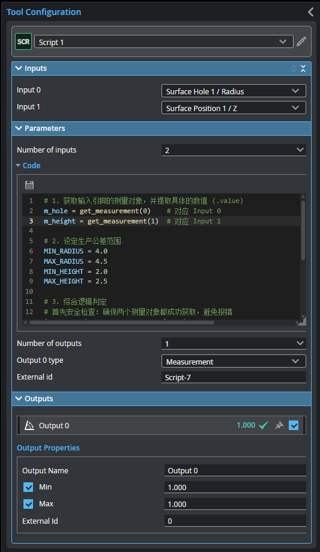{: style="display: block; margin: 0 auto; border-radius: 8px; box-shadow: 0 2px 10px rgba(0,0,0,0.1);" }

<p align="center" style="color: #666; font-size: 14px; margin-top: 10px; margin-bottom: 20px;">通过 GoPxL 专用 API 函数，使用 Python 编写多条件判定逻辑</p>

---

## 4. 界面操作技巧 (Tips & Tricks)

!!! note "快速编辑模式 (Quick Edit)"
    当您的任务中包含大量测量工具时，每次修改参数后视图的刷新可能会导致卡顿。您可以开启界面顶部的 **Quick Edit (快速编辑)** 开关。在此模式下，修改参数不会立即刷新视图，大幅提升配置速度。**配置完成后，请务必关闭该模式以保存并应用更改**。

* **添加工具**：在左侧搜索框输入工具名称，直接拖拽到右侧的 Diagram 面板中。
* **复制/重命名/删除**：在 Tool Diagram 中点击工具右上角的齿轮图标（操作菜单），可以快速复制 (Duplicate) 或重命名。
* **固定输出 (Pinning Outputs)**：在工具的 Outputs 列表中，点击图钉 (Pin) 图标，可以将该测量值固定显示在主数据视图的右侧，方便实时监控。

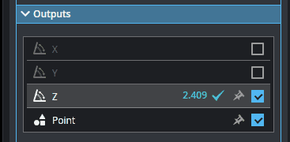{: style="display: block; margin: 0 auto; border-radius: 8px;" }

<p align="center" style="color: #666; font-size: 14px; margin-top: 10px; margin-bottom: 20px;">将关键测量结果固定到主视图</p>

!!! info "下一步建议"
    掌握了基础的测量工具与脚本配置后，建议您前往 [**系统集成 (Integration)**](gopxl_integration.md) 章节，学习如何将检测结果实时发送给产线上的 PLC、机械臂或上位机设备，完成整个视觉系统的闭环通讯。