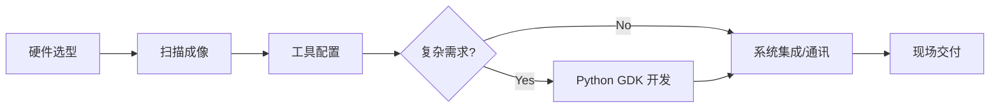

# 🚀 GoPxL 智能 3D 视觉培训手册 
编辑：Alfred Pu

欢迎来到 GoPxL 官方实战指南。

GoPxL 是 LMI Technologies 为 Gocator 系列传感器量身打造的**新一代跨平台机器视觉软件**。它不仅继承了 Gocator 经典的“开箱即用”理念，更在底层架构、数据处理能力、人工智能融合以及用户体验上进行了彻底的重构，标志着工业 3D/2D 视觉软件进入了一个全新的时代。

无论您是视觉新手还是资深开发工程师，GoPxL 都能为您提供强大且灵活的工具链，以应对当今极其复杂的生产检测，视觉引导等需求。

---

### 1️⃣ 准备工作
*在开始扫描前，请确保您已选择合适的硬件并熟悉软件环境。*

-   :material-eye-check:{ .lg .middle } __传感器选型__
    ---
    根据视野(FOV)和精度要求选择合适的 Gocator。
    [:octicons-arrow-right-24: 选型指南](sensor.md)

-   :material-laptop:{ .lg .middle } __软件环境介绍__
    ---
    了解 GoPxL 的全新界面布局与核心系统架构。
    [:octicons-arrow-right-24: 熟悉软件](gopxl_introduction.md)

---

### 2️⃣ 基础操作
*建立传感器连接，优化成像质量并配置基础测量任务。*

-   :material-flash-outline:{ .lg .middle } __快速指南__
    ---
    从零开始配置您的第一个 GoPxL 传感器任务。
    [:octicons-arrow-right-24: 立即开始](gopxl_quickstart.md)

-   :material-camera-iris:{ .lg .middle } __扫描成像__
    ---
    深入理解曝光、触发及 3D 成像优化原理。
    [:octicons-arrow-right-24: 优化成像](gopxl_scan.md)

-   :material-hammer-wrench:{ .lg .middle } __工具介绍__
    ---
    掌握核心内置测量工具及其参数配置技巧。
    [:octicons-arrow-right-24: 工具详解](gopxl_tools.md)

-   :material-transit-connection-variant:{ .lg .middle } __系统集成__
    ---
    配置数据输出协议（PLC/TCP/Modbus等）。
    [:octicons-arrow-right-24: 开始集成](gopxl_integration.md)

---

### 3️⃣ 高级功能
*针对复杂场景的算法扩展、AI 应用与多维度标定。*

-   :material-robot-industrial:{ .lg .middle } __AI 工具__
    ---
    使用深度学习工具解决传统算法难以应对的缺陷检测。
    [:octicons-arrow-right-24: AI 赋能](gopxl_ai.md)

-   :material-code-braces:{ .lg .middle } __Python & GDK__
    ---
    使用脚本编写自定义测量逻辑与算法扩展。
    [:octicons-arrow-right-24: 脚本开发](gopxl_pythontools.md)

-   :material-vector-combine:{ .lg .middle } __多传感器标定__
    ---
    拼接多个传感器视野，实现超大尺寸工件测量。
    [:octicons-arrow-right-24: 多机标定](gopxl_multisensors.md)

-   :material-robot-confused:{ .lg .middle } __机器人标定__
    ---
    手眼标定、九点标定及坐标系转换核心算法。
    [:octicons-arrow-right-24: 机器人集成](gopxl_robotcalibration.md)

---

## 🛠️ 学习路径

为了让你更系统地掌握，我们推荐以下路径：

!!! info "最新更新"
    * 2026-3-4: Base GoPxL1.4 完成初版
